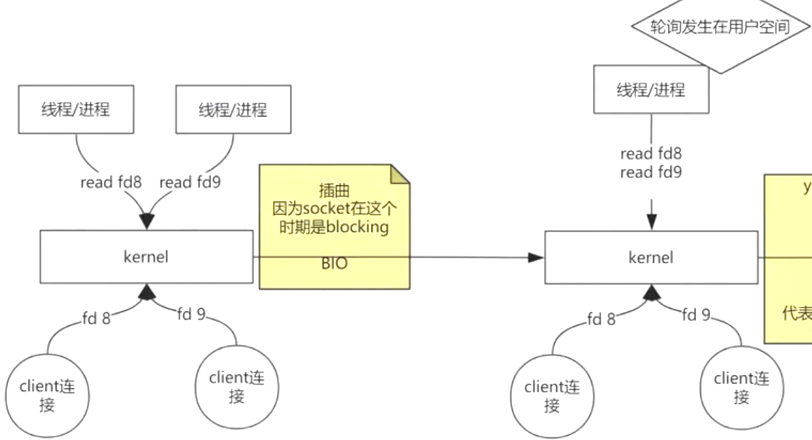
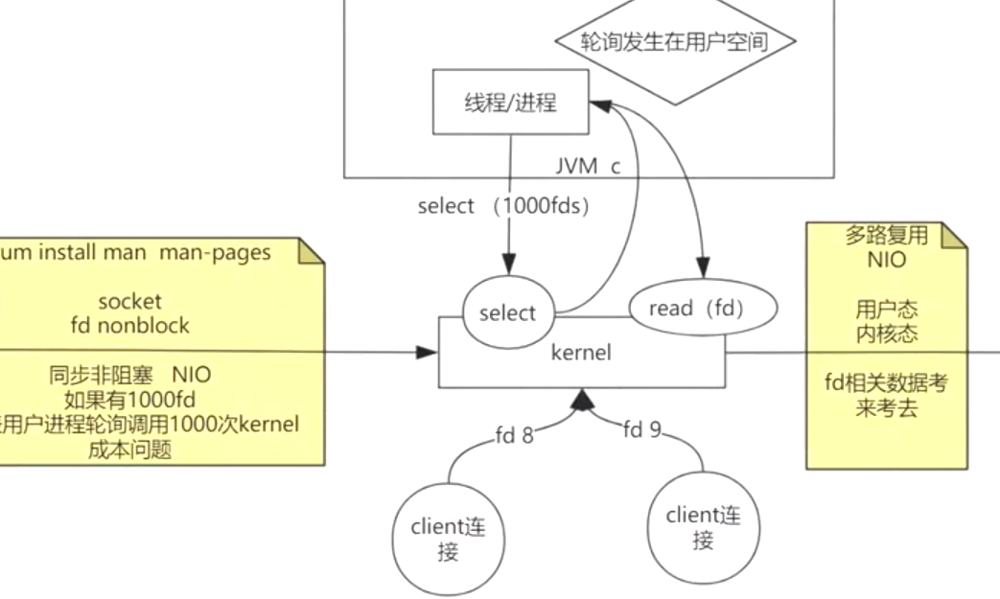
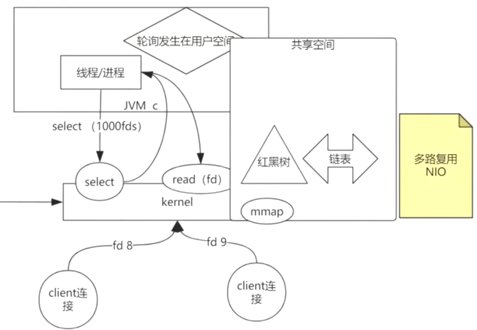
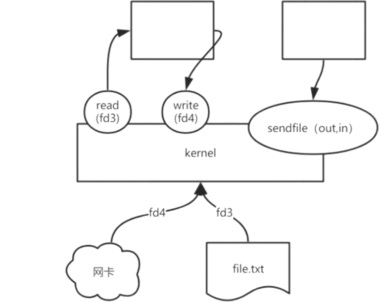
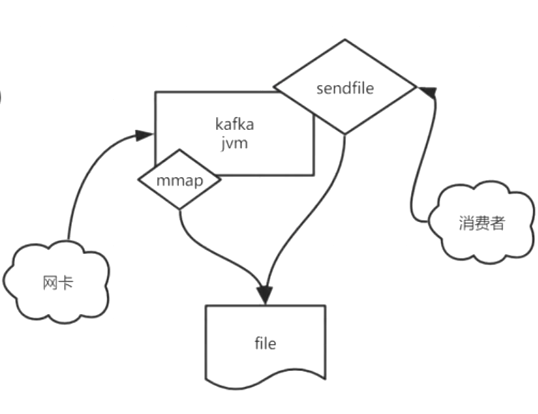
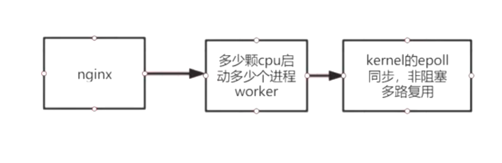

# kernel

## FD 文件描述符

### Linux的IO模型（BIO bloack）

* ##### 早先的阻塞IO（BIO, Blocking IO）

  客户端连接先到达内核，进程/线程通过**read**获取客户端连接fd时，当客户端数据还传输未完成时将造成socket阻塞。所以叫阻塞的IO。

* ##### 同步非阻塞IO（NIO, nonblock IO）

  通过在**用户空间轮询fd**（文件描述符），同步去read调用内核，获取已成功的客户端连接fd，解决了阻塞的问题，实现非阻塞IO（NIO）。

* ##### 多路复用非阻塞IO（NIO, nonblock IO）

  用户空间将fds（文件描述符集）传递给内核的**系统调用select**，**内核自己轮询fd**（文件描述符）将结果批量发送给用户空间，用户空间根据结果通过read获取已完成的客户端连接fd，解决阻塞和用户态与内核台频繁切换的成本问题，实现多路复用NIO。

* 共享空间（MMap）

* 零拷贝（sendfile）

  通过将原本read与write操作频繁对内核进行交互，改为通过sendfile？接口**？，直接进行文件读写操作。

* KafKa

  通过将mmap（共享空间）+sendfile（零拷贝）组合使用实现。

  

<left><left>

* Nignx

  

> 
>
> 参考文献
>
> http://www.52im.net/thread-306-1-1.html

