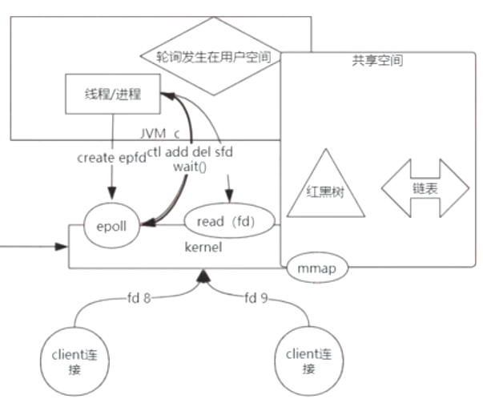

# 内核kernel

## FD（file descriptor） 文件描述符

> 百度百科
>
> [内核](https://baike.baidu.com/item/内核/108410)（kernel）利用文件描述符（file descriptor）来访问文件。文件描述符是[非负整数](https://baike.baidu.com/item/非负整数/2951833)。打开现存文件或新建文件时，内核会返回一个文件描述符。读写文件也需要使用文件描述符来指定待读写的文件。

## Linux I/O模型

##### 同步和异步

> 同步IO，是一种用户空间与内核空间的调用发起方式。同步IO是指用户空间线程是主动发起IO请求的一方，内核空间是被动接受方。异步IO则反过来，是指内核kernel是主动发起IO请求的一方，用户线程是被动接受方。

##### 基本 Linux I/O 模型的简单矩阵

#### 四大IO模型

* ##### 同步阻塞IO（BIO, Blocking IO）

  早先的LinuxIO处理，客户端连接先到达内核，进程/线程通过**read**获取客户端连接fd时，当客户端IO未彻底完成时将造成socket阻塞。所以叫阻塞的IO。

  在java中，默认创建的socket都是阻塞的。

  

* ##### 同步非阻塞IO（NIO, Non-Blocking IO）

  > 这里的NIO并不是指JAVA的NIO（New IO）库

  通过在**用户空间轮询fd**（文件描述符），同步去read调用内核，内核立即返回给用户一个状态值，解决了阻塞的问题，实现非阻塞IO（NIO）。

  

* ##### 多路复用IO（IO Multiplexing）

  > IO多路复用模型的基本原理就是select/epoll系统调用，单个线程不断的轮询select/epoll系统调用所负责的成百上千的socket连接，当某个或者某些socket网络连接有数据到达了，就返回这些可以读写的连接。因此，好处也就显而易见了——通过一次select/epoll系统调用，就查询到到可以读写的一个甚至是成百上千的网络连接。

  特点：

  1. 经典的Reactor设计模式，有时也称为**异步阻塞IO**。用户线程获得了目标连接后，发起read系统调用，用户线程会被阻塞。

  2. Java中的Selector和Linux中的epoll都是这种模型，Selector是对select 、poll和epoll的封装，叫做New IO。

  

  * **selelct**

    用户空间将fds（文件描述符集）批量传递给内核的**系统调用select**，**内核自己轮询fd**（文件描述符）将结果批量发送给用户空间，用户空间根据结果通过read获取已完成的客户端连接fd，解决阻塞和用户态与内核台频繁切换的成本问题，实现多路复用NIO。

  

  * **共享空间**（MMap）epoll

    > epoll是在linux 2.6内核中提出的，是select系统调用的linux增强版本。

* ##### 异步IO（AIO，Asynchronous IO）

  > 如何进一步提升效率，解除最后一点阻塞呢？这就是异步IO模型，全称asynchronous I/O，简称为AIO。
  >
  > Linux在2.6版本才引入

  AIO的基本流程是：用户线程通过系统调用，告知kernel内核启动某个IO操作，用户线程返回。kernel内核在整个IO操作（包括数据准备、数据复制）完成后，通知用户程序，用户执行后续的业务操作。

  

  #### 总结：

  目前来说， Windows 系统下通过 IOCP 实现了真正的异步 I/O。但是，就目前的业界形式来说，Windows 系统，很少作为百万级以上或者说高并发应用的服务器操作系统来使用。

  而在 Linux 系统下，异步IO模型在2.6版本才引入，目前并不完善。所以，这也是在 Linux 下，实现高并发网络编程时都是以 IO 复用模型模式为主。

  ### 其他IO模型

  

* ##### 零拷贝（sendfile）

  通过将原本read与write操作频繁对内核进行交互，改为通过sendfile？接口**？，直接进行文件读写操作。

* ##### KafKa

  通过将mmap（共享空间）+sendfile（零拷贝）组合使用实现。

* ##### Nignx

  

> 参考文献
>
> [10分钟看懂， Java NIO 底层原理](https://zhuanlan.zhihu.com/p/269733616)
>
> [聊聊Linux 五种IO模型](https://www.jianshu.com/p/486b0965c296)
>
> [Java新一代网络编程模型AIO原理及Linux系统AIO介绍](http://www.52im.net/thread-306-1-1.html)

