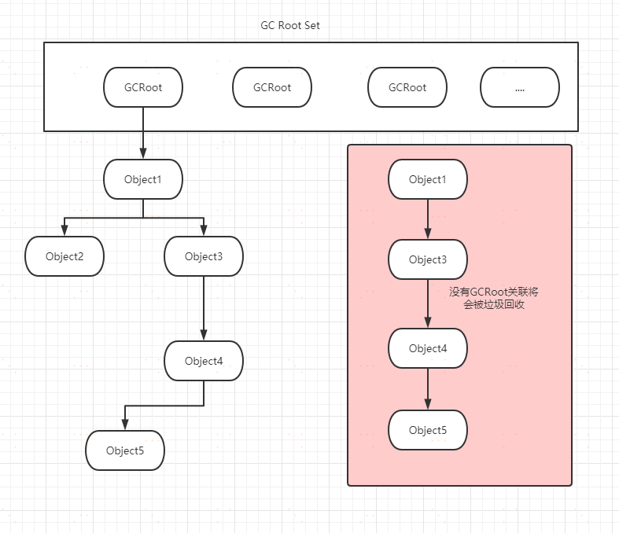
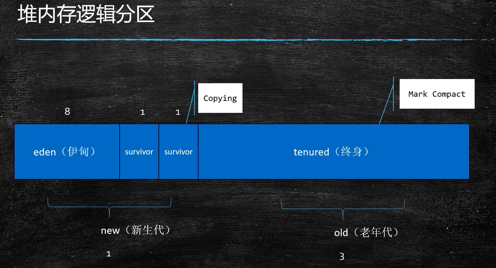

# JVM垃圾回收

> 程序的运行必然需要申请内存资源，无效的对象资源如果不及时处理就会一直占有内存资源，最终将导致内存溢出，所以对内存资源的管理是非常重要了。
>


## JVM垃圾回收机制

### 引用计数法

#####  原理：

​		假设有一个对象A，任何一个对象对A的引用，那么对象A的引用计数器+1，当引用失效时，对象A的引用计数器
就-1，如果对象A的计数器的值为0，就说明对象A没有引用了，可以被回收。


##### 优点：

​		实时性较高，无需等到内存不够的时候，才开始回收，运行时根据对象的计数器是否为0，就可以直接回收。
在垃圾回收过程中，应用无需挂起。如果申请内存时，内存不足，则立刻报outofmember 错误。
区域性，更新对象的计数器时，只是影响到该对象，不会扫描全部对象。


##### 缺点：

​		每次对象被引用时，都需要去更新计数器，有一点时间开销。
浪费CPU资源，即使内存够用，仍然在运行时进行计数器的统计。
无法解决循环引用问题。（最大的缺点）

```java
class TestA{
 public TestB b;
}

class TestB{
 public TestA a;
}

//虽然a和b都为null，但是由于a和b存在循环引用，这样a和b永远都不会被回收。
public class Main{
   public static void main(String[] args){
       A a = new A();
       B b = new B();
       a.b=b;
       b.a=a;
       a = null; //释放资源
       b = null; //释放资源
   }
}
```


### 可达性分析算法

##### 原理：

通过一系列称为“GC Roots”的根对象作为起始节点集，从这些节点开始，根据引用关系向下搜索，搜索过程所走过的路径称为“引用链”（Reference Chain），如果某个对象到GC Roots间没有任何引用链相连，就说明从GC Roots到这个对象不可达时，则证明此对象是不可能再被使用的，就是可以回收的对象。

<<<<<<< HEAD


##### 在JVM虚拟机中，可作为GC Roots的对象包括以下几种:

- 在==虚拟机栈==（栈帧中的本地变量表）中==引用的对象==，譬如各个线程被调用的方法堆栈中使用到的==参数、局部变量、临时变量==等。
- 在方法区中==类静态属性引用的对象==，譬如Java类的引用类型静态变量。
- 在方法区中常量引用的对象，譬如==字符串常量池（==String T able）里的引用。
- 在==本地方法栈中==JNI（即通常所说的Native方法）引用的对象。
- Java虚拟机内部的引用，如基本数据类型对应的Class对象，一些常==驻的异常对象==（比如NullPointExcepiton、OutOfMemoryError）等，还有==系统类加载器==。
- ==所有被同步锁（synchronized关键字）持有的对象==。反映Java虚拟机内部情况的JMXBean、JVMTI中注册的回调、本地代码缓存等。


=======
[](https://img2020.cnblogs.com/blog/874710/202007/874710-20200729150631042-1747200402.png)

###### 在JVM虚拟机中，可作为GC Roots的对象包括以下几种:

- 在虚拟机栈（栈帧中的本地变量表）中引用的对象，譬如各个线程被调用的方法堆栈中使用到的参数、局部变量、临时变量等。
- 在方法区中类静态属性引用的对象，譬如Java类的引用类型静态变量。
- 在方法区中常量引用的对象，譬如字符串常量池（String T able）里的引用。
- 在本地方法栈中JNI（即通常所说的Native方法）引用的对象。
- Java虚拟机内部的引用，如基本数据类型对应的Class对象，一些常驻的异常对象（比如NullPointExcepiton、OutOfMemoryError）等，还有系统类加载器。
- 所有被同步锁（synchronized关键字）持有的对象。反映Java虚拟机内部情况的JMXBean、JVMTI中注册的回调、本地代码缓存等。


###### 对象的引用

> 在java中，对象的引用分为：强引用（Strongly Re-ference）、软引用（Soft Reference）、弱引用（Weak Reference）和虚引用（Phantom Reference）4种。

- 强引用
  在程序代码之中普遍存在的引用赋值，即类似“Object obj=new Object()”这种引用关系。
  无论任何情况下，只要强引用关系还存在，垃圾收集器就永远不会回收掉被引用的对象。
- 软引用
  用来描述一些还有用，但非必须的对象。
  只被软引用关联着的对象，在系统将要发生内存溢出异常前，会把这些对象列进回收范围之中进行第二次回收，如果这次回收还没有足够的内存，才会抛出内存溢出异常。
- 弱引用
  用来描述那些非必须对象，但是它的强度比软引用更弱一些，被弱引用关联的对象只能存活到下一次垃圾收集发生为止。
  当垃圾收集器开始工作，无论当前内存是否足够，都会回收掉只被弱引用关联的对象。
- 虚引用
  最弱的一种引用关系，一个对象是否有虚引用的存在，完全不会对其生存时间构成影响，也无法通过虚引用来取得一个对象实例。
  为一个对象设置虚引用关联的唯一目的只是为了能在这个对象被收集器回收时收到一个系统通知。
>>>>>>> 4df259e0e3151344679740ab317073b7b8754dc3


## 如何回收垃圾

> 自动化的管理内存资源，垃圾回收机制必须要有一套算法来进行计算，哪些是有效的对象，哪些是无效的对象，对于无效的对象就要进行回收处理。


### 常见的垃圾回收算法

> 标记清除法、标记压缩法、复制算法、分代算法等。


#### **标记清除算法（Mark-Sweep）**

> 标记清除法可以说是最基础的收集算法，因为后续的收集算法大多都是以标记-清除算法为基础，对其缺点进行改进而得到的。

##### 原理：

标记清除算法，是将垃圾回收分为2个阶段，分别是标记和清除。**从根节点开始标记引用的对象，未被标记引用的对象就是垃圾对象，可以被清理。**

##### 优点：

* 解决了引用计数算法中的循环引用的问题，没有从root节点引用的对象都会被回收。

##### 缺点：

* **效率较低**。标记和清除两个动作都需要遍历所有的对象。
* 在GC时，**需要停止应用程序**，对于交互性要求比较高的应用而言这个体验是非常差的。
* **内存碎片化严重**。 


#### 标记压缩算法

> 标记压缩算法是在标记清除算法的基础之上，做了优化改进的算法。

##### 原理：

和标记清除算法一样，也是从根节点开始，对对象的引用进行标记，在清理阶段，并不是简单的清理未标记的对象，而是**将存活的对象压缩到内存的一端，然后清理边界以外的垃圾，从而解决了碎片化的问题。**

##### 优点：

* 解决了标记清除算法的碎片化的问题

##### 缺点：

* 效率降低，多了一步压缩，对象移动内存位置的步骤


#### **复制算法(copying)**

##### 原理：

<<<<<<< HEAD
将原有内存空间一分为二，每次只使用其中一块，在垃圾回收时，将==正在使用==的对象==复制==到另一个内存空间中，然后将当前内存块清空，交换两块内存的角色，从而完成垃圾回收。

##### 优点：

* 效率高。适合==垃圾较多==的场景，此时需要复制的对象较少。
=======
将原有内存空间一分为二，每次只使用其中一块，在垃圾回收时，将正在使用的对象复制到另一个内存空间中，然后将当前内存块清空，交换两块内存的角色，从而完成垃圾回收。

##### 优点：

* 效率高。适合垃圾较多的场景，此时需要复制的对象较少。
>>>>>>> 4df259e0e3151344679740ab317073b7b8754dc3
* 解决内存碎片

##### 缺点：

* 在垃圾对象少的情况下不适用。如：老年代内存
* 占用内存


### JVM分代模型算法

> 在堆内存中，有些对象短暂存活有些则是长久存活，所以需要将堆内存进行分代，将短暂存活的对象放到一起，进行高频率的回收，长久存活的对象集中放到一起，进行低频率的回收，这样才能够更加合理的利系统资源。分代算法其实就是这样的，根据回收对象的特点进行选择，在jvm中，年轻代适合使用复制算法，老年代适合使用标记清除或标记压缩算法。

##### 分代垃圾回收的相关概念：

* 部分收集（Partial GC）使用的模型
* 新生代收集（Minor GC/Young GC）：指目标只是新生代的垃圾收集。
* 老年代收集（Major GC/Old GC）：指目标只是老年代的垃圾收集。
* 永久代（1.7）/元数据区（1.8）
  * 永久带 元数据 -Class
  * 永久代必须指定大小限制，元数据区可以选择设置，无上限（受限于物理内存）
  * 字符串常量1.7 - 永久带，1.8 - 堆


##### 新生代回收流程（YGC）：

新生代=Eden+2个survivor区，使用的是Copying回收算法（8:1:1）

* 第一次YGC后，大多数对象会被回收，活着的进入S0

* 第二次YGC，活着的（eden+s0）—>S1
* 再次YGC，eden+S1—>S0
* 年龄足够—>老年代（15次，CMS16次）
* S区装不下—>老年代


##### 老年代：

<<<<<<< HEAD
* 老年代满了FGC (Full GC)
=======
* 老年代满了FGC Full GC
>>>>>>> 4df259e0e3151344679740ab317073b7b8754dc3


##### GC Tuning（Generation）

尽量减少FGC


##### 堆内存逻辑分区


<<<<<<< HEAD
=======


- 
>>>>>>> 4df259e0e3151344679740ab317073b7b8754dc3
