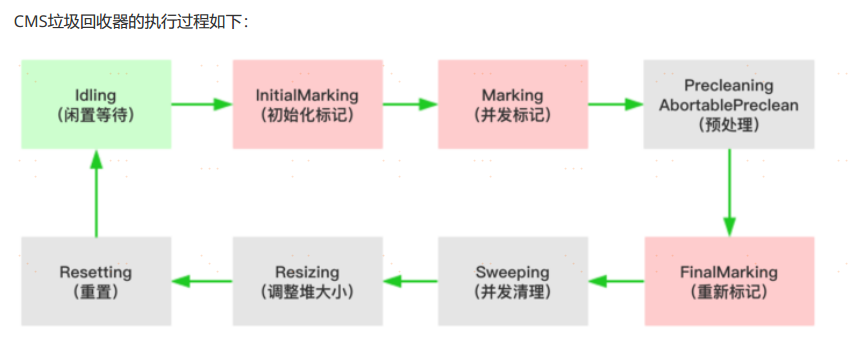
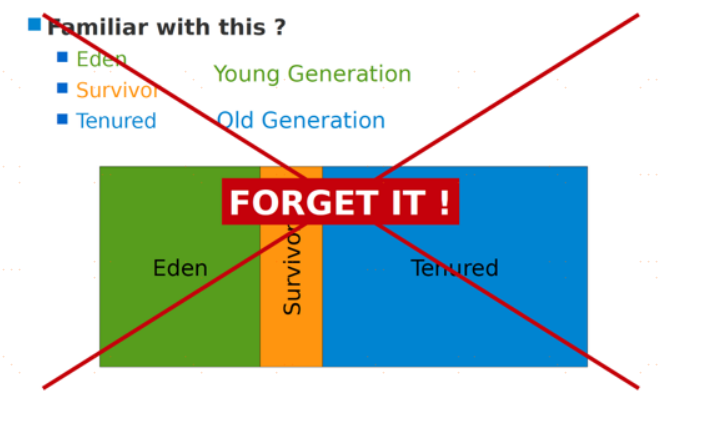
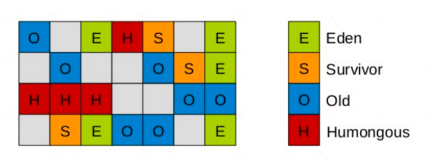
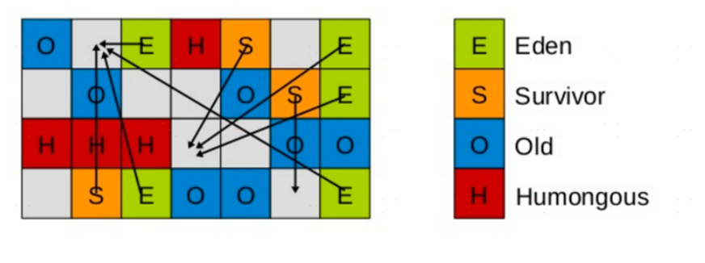
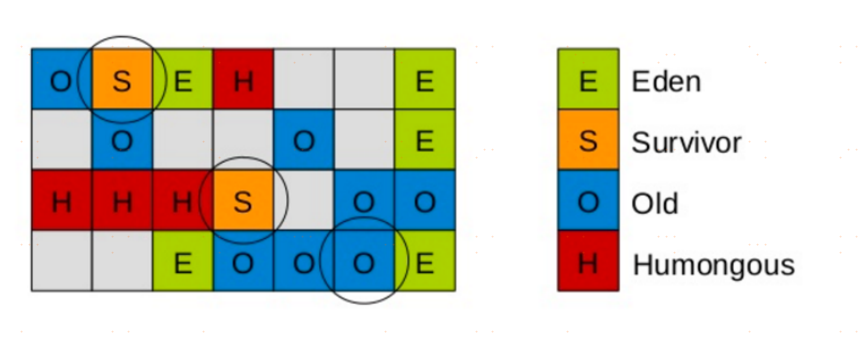
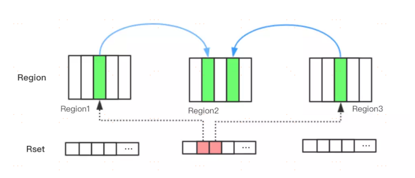
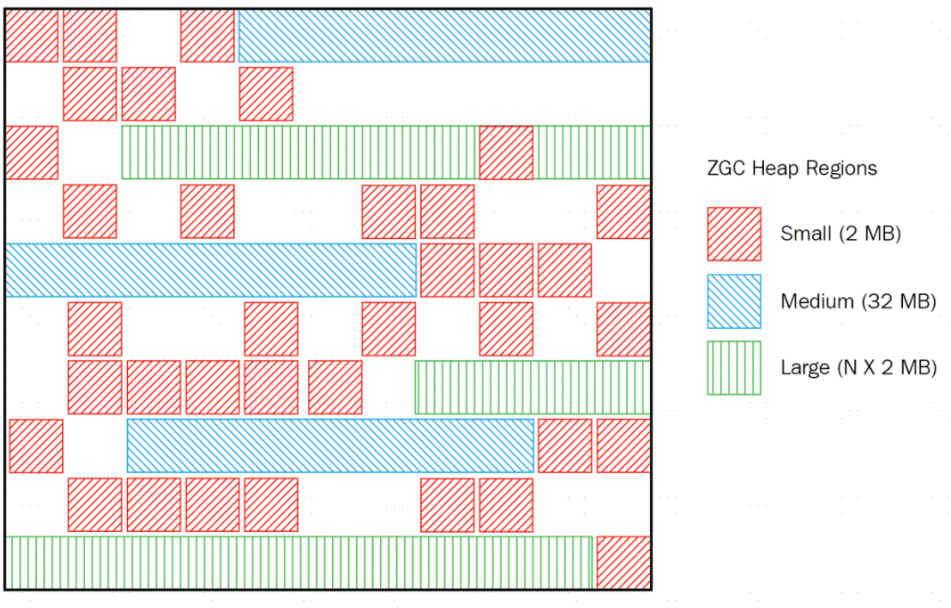
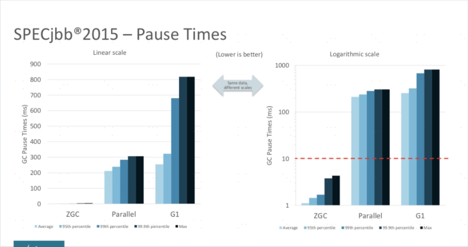
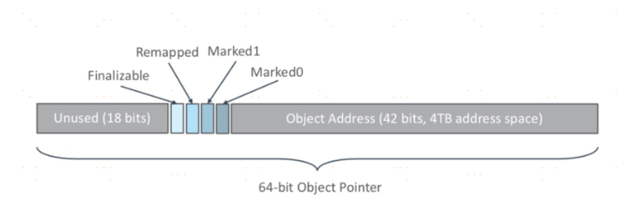

### 垃圾收集器

在jvm中，实现了多种垃圾收集器。1.8默认垃圾回收：PS+ParallelOld

包括：**串行垃圾收集器、并行垃圾收集器、CMS（并发）垃圾收集器、G1垃圾收集器、JDK11中的ZGC(超牛逼)**


#### 串行垃圾收集器（Serial）

> 对于交互性较强的应用而言，这种垃圾收集器是不能够接受的。一般在Javaweb应用中是不会采用该收集器的。

使用**单线程**进行垃圾回收，垃圾回收时，只有一个线程在工作，并且java应用中的**所有线程都要暂停**，等待垃圾回收的完成。这种现象称之为STW（Stop-The-World）。
​ 

#### 并行垃圾收集器（Parallels）

> 当然了，并行垃圾收集器在收集的过程中也会暂停应用程序，这个和串行垃圾回收器是一样的，只是并行执行，速度更快些，暂停的时间更短一些。

并行垃圾收集器在串行垃圾收集器的基础之上做了改进，将单线程改为了多线程进行垃圾回收，这样可以缩短垃圾回收的时间。（这里是指，并行能力较强的机器）


#### ParNew垃圾收集器

 ParNew垃圾收集器是工作在年轻代上的，只是将串行的垃圾收集器改为了并行。
​ 通过-XX:+UseParNewGC参数设置年轻代使用ParNew回收器，老年代使用的依然是串行收集器。

```
#参数
-XX:+UseParNewGC -XX:+PrintGCDetails -Xms16m -Xmx16m
#打印出的信息
[GC (Allocation Failure) [ParNew: 4416K->512K(4928K), 0.0032106 secs] 4416K->1988K(15872K), 0.0032697 secs] [Times: user=0.00 sys=0.00, real=0.00 secs] 
```

由以上信息可以看出， ParNew: 使用的是ParNew收集器。其他信息和串行收集器一致。


#### ParallelGC垃圾收集器

> ParallelGC收集器工作机制和ParNewGC收集器一样，只是在此基础之上，新增了两个和系统吞吐量相关的参数，使得其使用起来更加的灵活和高效。

相关参数如下：
	 -XX:+UseParallelGC
 年轻代使用ParallelGC垃圾回收器，老年代使用串行回收器。
 	-XX:+UseParallelOldGC
 年轻代使用ParallelGC垃圾回收器，老年代使用ParallelOldGC垃圾回收器。
 	-XX:MaxGCPauseMillis
 设置最大的垃圾收集时的停顿时间，单位为毫秒

有以上信息可以看出，年轻代和老年代都使用了ParallelGC垃圾回收器。


#### CMS垃圾收集器

 CMS全称Concurrent Mark Sweep，是一款并发的、使用标记-清除算法的垃圾回收器，该回收器是针对老年代垃圾回收的

通过参数 **-XX:+UseConcMarkSweepGC** 进行设置




- 初始化标记(CMS-initial-mark) ,标记root，会导致stw；
- 并发标记(CMS-concurrent-mark)，与用户线程同时运行；
- 预清理（CMS-concurrent-preclean），与用户线程同时运行；
- 重新标记(CMS-remark) ，会导致stw；
- 并发清除(CMS-concurrent-sweep)，与用户线程同时运行；
- 调整堆大小，设置CMS在清理之后进行内存压缩，目的是清理内存中的碎片；
- 并发重置状态等待下次CMS的触发(CMS-concurrent-reset)，与用户线程同时运行；


#### G1垃圾收集器

G1垃圾收集器是在jdk1.7中正式使用的全新的垃圾收集器，oracle官方计划在jdk9中将G1变成默认的垃圾收集器，
以替代CMS。
G1的设计原则就是简化JVM性能调优，开发人员只需要简单的三步即可完成调优：

1. 第一步，开启G1垃圾收集器
2. 第二步，设置堆的最大内存
3. 第三步，设置最大的停顿时间。

G1中提供了三种模式垃圾回收模式，Young GC、Mixed GC 和Full GC，在不同的条件下被触发。

**原理**

 G1垃圾收集器相对比其他收集器而言，最大的区别在于它取消了年轻代、老年代的物理划分，取而代之的是将堆划分为若干个区域（Region），这些区域中包含了有逻辑上的年轻代、老年代区域。
​ 这样做的好处就是，我们再也不用单独的空间对每个代进行设置了，不用担心每个代内存是否足够。

[](https://img2020.cnblogs.com/blog/874710/202007/874710-20200729150806710-1421670012.png)

[](https://img2020.cnblogs.com/blog/874710/202007/874710-20200729150815399-137851350.png)

 在G1划分的区域中，年轻代的垃圾收集依然采用暂停所有应用线程的方式，将存活对象拷贝到老年代或者Survivor空间，G1收集器通过将对象从一个区域复制到另外一个区域，完成了清理工作。
​ 这就意味着，在正常的处理过程中，G1完成了堆的压缩（至少是部分堆的压缩），这样也就不会有cms内存碎片问题的存在了。

在G1中，有一种特殊的区域，叫Humongous区域。

- 如果一个对象占用的空间超过了分区容量50%以上，G1收集器就认为这是一个巨型对象。
- 这些巨型对象，默认直接会被分配在老年代，但是如果它是一个短期存在的巨型对象，就会对垃圾收集器造成负面影响。
- 为了解决这个问题，G1划分了一个Humongous区，它用来专门存放巨型对象。如果一个H区装不下一个巨型对象，那么G1会寻找连续的H分区来存储。为了能找到连续的H区，有时候不得不启动Full GC。


#### Young GC

Young GC主要是对Eden区进行GC，它在Eden空间耗尽时会被触发。
Eden空间的数据移动到Survivor空间中，如果Survivor空间不够，Eden空间的部分数据会直接晋升到年老代空间。
Survivor区的数据移动到新的Survivor区中，也有部分数据晋升到老年代空间中。最终Eden空间的数据为空，GC停止工作，应用线程继续执行。

[](https://img2020.cnblogs.com/blog/874710/202007/874710-20200729150824762-743792745.png)

[](https://img2020.cnblogs.com/blog/874710/202007/874710-20200729150832158-773476663.png)

**Remembered Set（已记忆集合）**

在GC年轻代的对象时，我们如何找到年轻代中对象的根对象呢？
根对象可能是在年轻代中，也可以在老年代中，那么老年代中的所有对象都是根么？
如果全量扫描老年代，那么这样扫描下来会耗费大量的时间。
于是，G1引进了RSet的概念。它的全称是Remembered Set，其作用是跟踪指向某个堆内的对象引用。

[](https://img2020.cnblogs.com/blog/874710/202007/874710-20200729150841425-1071025719.png)

 每个Region初始化时，会初始化一个RSet，该集合用来记录并跟踪其它Region指向该Region中对象的引用，每个Region默认按照512Kb划分成多个Card，所以RSet需要记录的东西应该是xx Region的xx Card。


##### Mixed GC

 当越来越多的对象晋升到老年代old region时，为了避免堆内存被耗尽，虚拟机会触发一个混合的垃圾收集器，即Mixed GC，该算法并不是一个Old GC，除了回收整个Young Region，还会回收一部分的Old Region，这里需要注意：是一部分老年代，而不是全部老年代，可以选择哪些old region进行收集，从而可以对垃圾回收的耗时时间进行控制。也要注意的是Mixed GC 并不是Full GC。

 MixedGC什么时候触发？ 由参数-XX:InitiatingHeapOccupancyPercent=n 决定。默认：45%，该参数的意思是：当老年代大小占整个堆大小百分比达到该阀值时触发。

它的GC步骤分2步：

1. 全局并发标记（global concurrent marking）
2. 拷贝存活对象（evacuation）

**全局并发标记**

全局并发标记，执行过程分为五个步骤：
初始标记（initial mark，STW）
标记从根节点直接可达的对象，这个阶段会执行一次年轻代GC，会产生全局停顿。
根区域扫描（root region scan）
G1 GC 在初始标记的存活区扫描对老年代的引用，并标记被引用的对象。
该阶段与应用程序（非STW）同时运行，并且只有完成该阶段后，才能开始下一次STW 年轻代垃圾回收。
并发标记（Concurrent Marking）
G1 GC 在整个堆中查找可访问的（存活的）对象。该阶段与应用程序同时运行，可以被STW 年轻代垃圾回收中断。
重新标记（Remark，STW）
该阶段是STW 回收，因为程序在运行，针对上一次的标记进行修正。
清除垃圾（Cleanup，STW）
清点和重置标记状态，该阶段会STW，这个阶段并不会实际上去做垃圾的收集，等待evacuation阶段来回收。

**拷贝存活对象**

 Evacuation阶段是全暂停的。该阶段把一部分Region里的活对象拷贝到另一部分Region中，从而实现垃圾的回收清理。

**G1收集器相关参数**

- -XX:+UseG1GC
  使用G1 垃圾收集器
- -XX:MaxGCPauseMillis
  设置期望达到的最大GC停顿时间指标（会尽力实现，但不保证达到），默认值是200 毫秒。
- -XX:G1HeapRegionSize=n
  设置的G1 区域的大小。值是2 的幂，范围是1 MB 到32 MB 之间。目标是根据最小的Java 堆大小划分出约2048 个区域。默认是堆内存的1/2000。
- -XX:ParallelGCThreads=n
  设置STW 工作线程数的值。将n 的值设置为逻辑处理器的数量。n 的值与逻辑处理器的数量相同，最多为8。
- -XX:ConcGCThreads=n
  设置并行标记的线程数。将n 设置为并行垃圾回收线程数(ParallelGCThreads) 的1/4 左右。
- -XX:InitiatingHeapOccupancyPercent=n
  设置触发Mixed GC 的Java 堆占用率阈值。默认占用率是整个Java 堆的45%

**测试**


```
-XX:+UseG1GC -XX:MaxGCPauseMillis=100 -XX:+PrintGCDetails -Xmx256m
#日志
[GC pause (G1 Evacuation Pause) (young), 0.0044882 secs]
  [Parallel Time: 3.7 ms, GC Workers: 3]
     [GC Worker Start (ms): Min: 14763.7, Avg: 14763.8, Max: 14763.8, Diff: 0.1]
     #扫描根节点
     [Ext Root Scanning (ms): Min: 0.2, Avg: 0.3, Max: 0.3, Diff: 0.1, Sum: 0.8]
     #更新RS区域所消耗的时间
     [Update RS (ms): Min: 1.8, Avg: 1.9, Max: 1.9, Diff: 0.2, Sum: 5.6]
        [Processed Buffers: Min: 1, Avg: 1.7, Max: 3, Diff: 2, Sum: 5]
     [Scan RS (ms): Min: 0.0, Avg: 0.0, Max: 0.0, Diff: 0.0, Sum: 0.0]
     [Code Root Scanning (ms): Min: 0.0, Avg: 0.0, Max: 0.0, Diff: 0.0, Sum: 0.0]
     #对象拷贝
     [Object Copy (ms): Min: 1.1, Avg: 1.2, Max: 1.3, Diff: 0.2, Sum: 3.6]
     [Termination (ms): Min: 0.0, Avg: 0.1, Max: 0.2, Diff: 0.2, Sum: 0.2]
        [Termination Attempts: Min: 1, Avg: 1.0, Max: 1, Diff: 0, Sum: 3]
     [GC Worker Other (ms): Min: 0.0, Avg: 0.0, Max: 0.0, Diff: 0.0, Sum: 0.0]
     [GC Worker Total (ms): Min: 3.4, Avg: 3.4, Max: 3.5, Diff: 0.1, Sum: 10.3]
     [GC Worker End (ms): Min: 14767.2, Avg: 14767.2, Max: 14767.3, Diff: 0.1]
  [Code Root Fixup: 0.0 ms]
  [Code Root Purge: 0.0 ms]
  [Clear CT: 0.0 ms] #清空CardTable
  [Other: 0.7 ms]
     [Choose CSet: 0.0 ms] #选取CSet
     [Ref Proc: 0.5 ms] #弱引用、软引用的处理耗时
     [Ref Enq: 0.0 ms] #弱引用、软引用的入队耗时
     [Redirty Cards: 0.0 ms]
     [Humongous Register: 0.0 ms] #大对象区域注册耗时
     [Humongous Reclaim: 0.0 ms] #大对象区域回收耗时
     [Free CSet: 0.0 ms]
  [Eden: 7168.0K(7168.0K)->0.0B(13.0M) Survivors: 2048.0K->2048.0K Heap:
55.5M(192.0M)->48.5M(192.0M)] #年轻代的大小统计
[Times: user=0.00 sys=0.00, real=0.00 secs] 
```

**对于G1垃圾收集器优化建议**

- 年轻代大小
  避免使用-Xmn 选项或-XX:NewRatio 等其他相关选项显式设置年轻代大小。固定年轻代的大小会覆盖暂停时间目标。
- 暂停时间目标不要太过严苛
  G1 GC 的吞吐量目标是90% 的应用程序时间和10%的垃圾回收时间。评估G1 GC 的吞吐量时，暂停时间目标不要太严苛。目标太过严苛表示您愿意承受更多的垃圾回收开销，而这会直接影响到吞吐量。

***3\***|***5\*****ZGC**

 ZGC是一款在JDK 11中新加入的具有实验性质的低延迟垃圾收集器，是由Oracle公司研发的。ZGC的目标是希望在尽可能对吞吐量影响不太大的前提下，实现在任意堆内存大小下都可以把垃圾收集的停顿时间限制在10毫秒以内的低延迟。

**内存布局**

 ZGC的内存布局与G1一样，也采用基于Region的堆内存布局，但不同的是，ZGC的Page（ZGC中称之为页面，道理和Region一样）具有动态性——动态创建和销毁，以及动态的区域容量大小。在x64硬件平台下，ZGC的Pag可以具有大、中、小三类容量：

- 小型页面（Small Page）：容量固定为2MB，用于放置小于256KB的小对象。

- 中型页面（Medium Page）：容量固定为32MB，用于放置大于等于256KB但小于4MB的对象。

- 大型页面（Large Page）：容量不固定，可以动态变化，但必须为2MB的整数倍，用于放置4MB或以上的大对象。

  每个大页面中只会存放一个大对象，这也预示着虽然名字叫作“大型Page”，但它的实际容量完全有可能小于中型Page，最小容量可低至4MB。
  大型Page在ZGC的实现中是不会被重分配（重分配是ZGC的一种处理动作）的，因为复制一个大对象的代价非常高昂。

[](https://img2020.cnblogs.com/blog/874710/202007/874710-20200729150857694-1918710759.png)

**性能表现**

 在性能方面，尽管目前还处于实验状态，还没有完成所有特性，稳定性打磨和性能调优也仍在进行，但即使是这种状态下的ZGC，其性能表现已经相当亮眼，从官方给出的测试结果来看，用“令人震惊的、革命性的ZGC”来形容都不为过。

[](https://img2020.cnblogs.com/blog/874710/202007/874710-20200729150905781-1762122726.png)

 ZGC与Parallel Scavenge、G1三款收集器通过SPECjbb 2015（java服务器业务测试工具）的测试结果。在ZGC的“弱项”吞吐量方面，以低延迟为首要目标的ZGC已经达到了以高吞吐量为目标Parallel Scavenge的99%，直接超越了G1。如果将吞吐量测试设定为面向SLA（Service Level Agreements）应用的“Critical Throughput” （要求最大延迟不超过某个设置值（10毫秒到100毫秒）下测得的吞吐量）的话，ZGC的表现甚至还反超ParallelScavenge收集器。

 ZGC的强项停顿时间测试上，它就毫不留情地与Parallel Scavenge、G1拉开了两个数量级的差距。不论是平均停顿，还是95%停顿、99%停顿、99.9%停顿，抑或是最大停顿时间，ZGC均能毫不费劲地控制在十毫秒之内，以至于把它和另外两款停顿数百近千毫秒的收集器放到一起对比，就几乎显示不了ZGC的柱状条（图a），必须把结果的纵坐标从线性尺度调整成对数尺度（图b，纵坐标轴的尺度是对数增长的）才能观察到ZGC的测试结果。

**使用**

 在jdk11下，只能在linux 64位的平台上使用ZGC，如果想要在Windows下使用ZGC就需要升级jdk到14了。


```
cd /usr/local/src/
#上传jdk-11.0.7_linux-x64_bin.tar.gz
tar -xvf jdk-11.0.7_linux-x64_bin.tar.gz
#如果本身已经安装openjdk的话，先删除
java –version
rpm -qa | grep java
rpm -e --nodeps java-xxxx-openjdk-xxxx.x86_64
vim /etc/profile
#写入如下内容
#set java environment
JAVA_HOME=/usr/local/src/jdk-11.0.7
CLASSPATH=.:$JAVA_HOME/lib.tools.jar
PATH=$JAVA_HOME/bin:$PATH
export JAVA_HOME CLASSPATH PATH
#生效
source /etc/profile
```


```
#执行命令
java -XX:+UnlockExperimentalVMOptions -XX:+UseZGC -Xmx256m -Xlog:gc*=info TestGC
#参数说明
-XX:+UnlockExperimentalVMOptions 解锁实验参数
-XX:+UseZGC  启用ZGC垃圾收集器
-Xmx256m  设置最大内存
-Xlog:gc*=info  设置打印gc日志信息
#设置并行的线程数，一般默认即可
-XX:ConcGCThreads  
#执行日志
[1.141s][info][gc,start    ] GC(2) Garbage Collection (Warmup)
[1.141s][info][gc,phases   ] GC(2) Pause Mark Start 0.190ms
[1.143s][info][gc,phases   ] GC(2) Concurrent Mark 1.837ms
[1.143s][info][gc,phases   ] GC(2) Pause Mark End 0.136ms
[1.144s][info][gc,phases   ] GC(2) Concurrent Process Non-Strong References 0.308ms
[1.144s][info][gc,phases   ] GC(2) Concurrent Reset Relocation Set 0.001ms
[1.144s][info][gc,phases   ] GC(2) Concurrent Destroy Detached Pages 0.000ms
[1.145s][info][gc,phases   ] GC(2) Concurrent Select Relocation Set 1.219ms
[1.145s][info][gc,phases   ] GC(2) Concurrent Prepare Relocation Set 0.009ms
[1.145s][info][gc,phases   ] GC(2) Pause Relocate Start 0.230ms
[1.146s][info][gc,phases   ] GC(2) Concurrent Relocate 0.853ms
[1.146s][info][gc,load     ] GC(2) Load: 0.00/0.02/0.05
[1.146s][info][gc,mmu      ] GC(2) MMU: 2ms/78.1%, 5ms/88.9%, 10ms/93.4%, 20ms/96.7%,
50ms/98.7%, 100ms/99.0%
[1.146s][info][gc,marking  ] GC(2) Mark: 1 stripe(s), 1 proactive flush(es), 1
terminate flush(es), 0 completion(s), 0 continuation(s)
[1.146s][info][gc,reloc    ] GC(2) Relocation: Successful, 1M relocated
[1.146s][info][gc,nmethod  ] GC(2) NMethods: 59 registered, 0 unregistered
[1.146s][info][gc,metaspace] GC(2) Metaspace: 4M used, 4M capacity, 5M committed, 8M
reserved
[1.146s][info][gc,ref      ] GC(2) Soft: 131 encountered, 0 discovered, 0 enqueued
[1.146s][info][gc,ref      ] GC(2) Weak: 222 encountered, 215 discovered, 0 enqueued
[1.146s][info][gc,ref      ] GC(2) Final: 0 encountered, 0 discovered, 0 enqueued
[1.146s][info][gc,ref      ] GC(2) Phantom: 1 encountered, 1 discovered, 0 enqueued
[1.146s][info][gc,heap     ] GC(2)                Mark Start          Mark End       
Relocate Start      Relocate End           High               Low
[1.146s][info][gc,heap     ] GC(2)  Capacity:      114M (45%)         114M (45%)      
  114M (45%)         114M (45%)         114M (45%)         114M (45%)
[1.146s][info][gc,heap     ] GC(2)   Reserve:       36M (14%)          36M (14%)      
   36M (14%)          36M (14%)          36M (14%)          36M (14%)
[1.146s][info][gc,heap     ] GC(2)      Free:      142M (55%)         142M (55%)      
  184M (72%)         184M (72%)         184M (72%)         142M (55%)
[1.146s][info][gc,heap     ] GC(2)      Used:       78M (30%)          78M (30%)      
   36M (14%)          36M (14%)          78M (30%)          36M (14%)
[1.146s][info][gc,heap     ] GC(2)      Live:         -                 1M (1%)        
   1M (1%)            1M (1%)             -                  -[1.146s][info][gc,heap     ] GC(2) Allocated:         -                 0M (0%)        
   0M (0%)            4M (2%)             -                  -[1.146s][info][gc,heap     ] GC(2)   Garbage:         -                76M (30%)      
   34M (14%)          34M (14%)            -                  -[1.146s][info][gc,heap     ] GC(2) Reclaimed:         -                  -            
   42M (16%)          42M (16%)            -                  -[1.146s][info][gc          ] GC(2) Garbage Collection (Warmup) 78M(30%)->36M(14%)
```

**染色指针技术**

ZGC为了实现目标，新增了染色指针技术。

[](https://img2020.cnblogs.com/blog/874710/202007/874710-20200729150917930-882437639.png)

 染色指针是一种直接将少量额外的信息存储在指针上的技术，在64位系统中，理论可以访问的内存高达16EB（2的64次幂）字节。实际上，64位的Linux则分别支持47位（128TB）的进程虚拟地址空间和46位（64TB）的物理地址空间，64位的Windows系统甚至只支持44位（16TB）的物理地址空间。
​ Linux下64位指针的高18位不能用来寻址，但剩余的46位指针所能支持的64TB内存在今天仍然能够充分满足大型服务器的需要。
​ ZGC的染色指针技术使用上了这剩下的46位指针宽度，将其高4位提取出来存储四个标志信息。通过这些标志位，虚拟机可以直接从指针中看到其引用对象的三色标记状态、是否进入了重分配集（即被移动过）、是否只能通过finalize()方法才能被访问到。
​ 由于这些标志位进一步压缩了原本就只有46位的地址空间，也直接导致ZGC能够管理的内存不可以超过4TB（2的42次幂）。

**染色指针的好处**

- 染色指针可以使得一旦某个Region的存活对象被移走之后，这个Region立即就能够被释放和重用掉，而不必等待整个堆中所有指向该Region的引用都被修正后才能清理。
- 染色指针可以大幅减少在垃圾收集过程中内存屏障的使用数量。
  一般写屏障的目的通常是为了记录对象引用的变动情况，如果将这些信息直接维护在指针中，显然就可以省去一些专门的记录操作。
  ZGC都并未使用任何写屏障，只使用了读屏障。
  染色指针可以作为一种可扩展的存储结构用来记录更多与对象标记、重定位过程相关的数据，以便日后进一步提高性能。

**工作过程**

[](https://img2020.cnblogs.com/blog/874710/202007/874710-20200729150926216-1768377736.png)

 ZGC的运作过程大致可划分为四个大的阶段，这四个阶段都是可以并发执行的。仅在Mark Start、Initial Mark 阶段中会存在短暂的STW。

- 并发标记（Concurrent Mark）
  与G1一样，并发标记是遍历对象图做可达性分析的阶段，前后也要经过初始标记、最终标记的短暂停顿。

  ZGC的标记是在指针上而不是在对象上进行的，标记阶段会更新染色指针中的Marked 0、Marked 1标志位。

- 并发预备重分配（Concurrent Prepare for Relocate）
  这个阶段需要根据特定的查询条件统计得出本次收集过程要清理哪些Region，将这些Region组成重分配集（Relocation Set）。
  ZGC每次回收都会扫描所有的Region，用范围更大的扫描成本换取省去G1中记忆集的维护成本。
  ZGC的重分配集只是决定了里面的存活对象会被重新复制到其他的Region中，里面的Region会被释放。

- 并发重分配（Concurrent Relocate）

  重分配是ZGC执行过程中的核心阶段，这个过程要把重分配集中的存活对象复制到新的Region上，并为重分配集中的每个Region维护一个转发表（Forward T able），记录从旧对象到新对象的转向关系。
  由于使用了染色指针的支持，ZGC收集器能仅从引用上就明确得知一个对象是否处于重分配集之中，如果用户线程此时并发访问了位于重分配集中的对象，这次访问将会被预置的内存屏障所截获，然后立即根据Region上的转发表记录将访问转发到新复制的对象上，并同时修正更新该引用的值，使其直接指向新对象，ZGC将这种行为称为指针的“自愈”（Self-Healing）能力。

- 并发重映射（Concurrent Remap）
  重映射所做的就是修正整个堆中指向重分配集中旧对象的所有引用。
  并发重映射并不是一个必须要“迫切”去完成的任务，但是当所有指针都被修正之后，原来记录新旧对象关系的转发表就可以释放掉了。