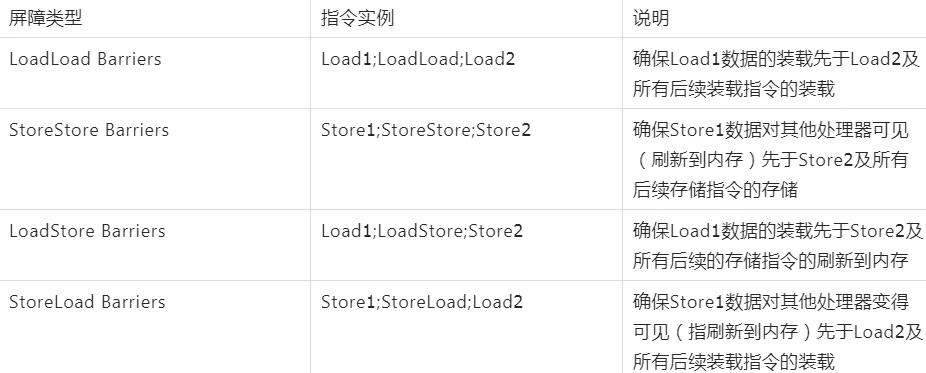

## JAVA锁机制

#### lock和synchronized的区别

1. Lock是一个接口，synchronized是关键字
2. lock在finally中必须释放锁，不然容易造成线程死锁

3. Lock中叫做重入锁，synchronized中叫做偏向锁
4. ==synchronized无法判断线程状态，lock可以==
5. Lock可重入 可判断 可公平（两者皆可），synchronized可重入 不可中断 非公平

### CAS （Compare And Set）无锁优化-自旋

> CAS算法是计算机硬件对并发操作共享数据的支持，CAS包含3个操作数：

* CAS算法：内存值V，预估值A，更新值B

* ABA问题
  * 值类型没有问题，对象（引用类型）的话就会出问题

### Volatile

* 保证线程的可见性

  根据MESI，CPU缓存一执性协议实现。

  

* 禁止指令重排序（CPU）：

  写内存屏障（Store Memory Barrier）：处理器将存储缓存值**写回主存**（阻塞方式）。

  读内存屏障（Load Memory Barrier）：处理器，处理**失效队列**（阻塞方式）。

  模型里有8个指令完成数据的读写，通过其中load和store指令相互组合成4个==内存屏障== （Memory Barrier）实现禁止指令重排序。

  

  通过加入内存屏障和禁止重排序优化来实现的

  - 在每个volatile写操作前插入StoreStore屏障，在写操作后插入StoreLoad屏障
  - 在每个volatile读操作前插入LoadLoad屏障，在读操作后插入LoadStore屏障

  通俗地讲：volatile变量在每次被线程访问时，都强迫从主内存中重读该变量的值，而当该变量发生变化时，又会强迫将最新的值刷新到主内存。这样任何时刻，不同的线程总能看到该变量的最新值。

  

  JVM new一个对象时主要有三部指令：1.申请一个内存2.给成员变量赋初始值3.三是将指针付给定义。
  
  Volatile可以解决DCL单例双重锁定Double Check Lock的指令重排序问题

#### happens-before原则

JMM可以通过happens-before关系向程序员提供跨线程的内存可见性保证（如果A线程的写操作a与B线程的读操作b之间存在happens-before关系，尽管a操作和b操作在不同的线程中执行，但JMM向程序员保证a操作将对b操作可见）。

### Synchronized

> Synchronized关键字，对某个对象（Object）加锁 。当对某个对象加锁后，必须要拿到这个对象的锁才能继续访问。
>
> 1.6之前推崇Synchronized

#### 特点：

* 可重入锁、独占锁
* 不能对`String`、`Integer`、`Long`：造成同时锁定
* 锁定方法与非锁定方法可同时执行
* 既保证了==原子性==又保证了==可见性==
* 程序中若出现异常，锁将会被释放
* 锁只能升级不能降级。
* 执行时间长、数量多的用系统（OS）锁，执行时间短、线程少的用自旋锁
* 锁的属性发生改变，没有问题，当重新赋值或new后则出现问题，加final
* ==synchronized不可响应中断，一个线程获取不到锁就一直等着==

##### synchronized锁升级

> 偏向锁-自旋锁-重量级锁

JDK早期是重量级的，需要向OS去申请，JDK1.5之后，后来改进成锁升级的一个概念，

当使用sync时，先是无锁状态，然后在markword记录这个线程的ID（偏向锁）一个线程在执行

如果有线程争用，升级为自旋锁，10次

10次后，升级为重量级锁。

#### 锁优化

减少锁持有时间

减小锁粒度

锁分离

锁粗化

锁消除

### ReentrantLock(重入锁)

* 独占、可重入锁
* 加锁解锁手动进行，且次数需要一样
* 锁可以中断
* ReentrantLock还可以实现公平锁机制

### AbstractQueuedSynchronizer（AQS）

> 抽象的队列式的同步器 ：AQS定义了一套多线程访问共享资源的同步器框架，许多同步类实现都依赖于它，如常用的ReentrantLock/Semaphore/CountDownLatch...。

##### 概括：

* 底层实现的数据结构是一个**双向链表**。

* 它维护了一个**volatile int state**（代表公共资源）

* 实现了一个**FIFO**(FirstIn、FisrtOut先进先出)的**线程等待队列**（多线程争用资源被阻塞时会进入此队列）

#### state的访问方式有三种

* getState()
* setState()
* compareAndSetState() 它定义两种资源共享方式
  * Exclusive 独占
  * Share 共享

### 读写锁（ReadWriteLock）

## 分布式锁

* setnx
* 过期时间
* 多线程（守护时间），延长过期时间
* redission
* zookeeoer

更多的是在DB或在架构上做出调整