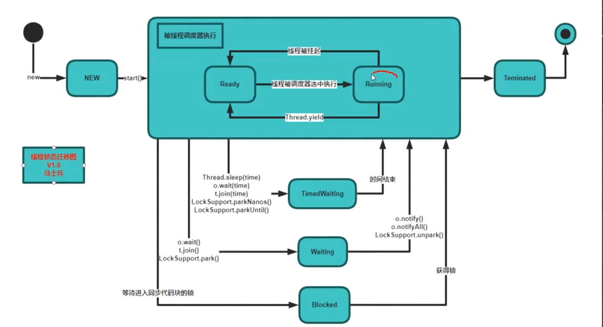

# 多线程（JUC）

> 在 Java 5.0 提供了 java.util.concurrent （简称JUC ）包,在此包中增加了在并发编程中很常用的实用工具类，用于定义类似于线程的自定义子系统，包括线程池、异步 IO 和轻量级任务框架。提供可调的、灵活的线程池。还提供了设计用于多线程上下文中的 Collection 实现等。

## 多线程基础

##### 多线程的创建方式？

* 继承`Thread`方法，通过`new MyThread().start();`进行调用。

* 实现`Runnable`接口，通过`new Thread(new MyThread()).start();`调用。

* `Executors.newCachedThreadPool`创建一个线程池。

##### 多线程的常用方法？

* `Thread.Yield();`	让出当前CPU，进入CPU等待队列，让其他线程先执行。

* `Thread.Join();`	常用来等待另一个线程的结束

* `getState();`	获取线程状态

#### 线程状态的迁移？

总共分为6个状态，new、Runnable、Blocked、Waiting、TimedWaiting、Teminated

> `Runnable`？

当`new一个线程` `start()`之后，会交给**线程调度器执行**此时的状态叫`runnable`，在这里会有2种状态，一个是在等待队列里等待执行时的`Ready`状态，另一个是执行中`Running`状态，当线程被线程调度器选中执行时，会变成`Running`状态，如果在`Running`时调用了`Thread.Yield();`则会回到`Ready`状态，如果执行结束进入`Teminated`结束状态，在此状态后不允许在此进入`new`调用`start().`

> `Waiting`？

当在运行中调用了`Wait()`,`join()`,`LockSupport.park()`进入`Waiting`状态，调用`notify()`、`notifyAll`、`LockSupport.unpark()`进入`Runnable`的`Running`状态

> `TimedWaiting`?

`sleep(time)`、`join(time)`、`wait(time)`等等 进入此状态，时间结束自动回到`TimedWaiting`。

> `Blocked`?

未获得锁时 进入，获得锁后 离开。 

##### t.join(); //调用join方法，等待线程t执行完毕

