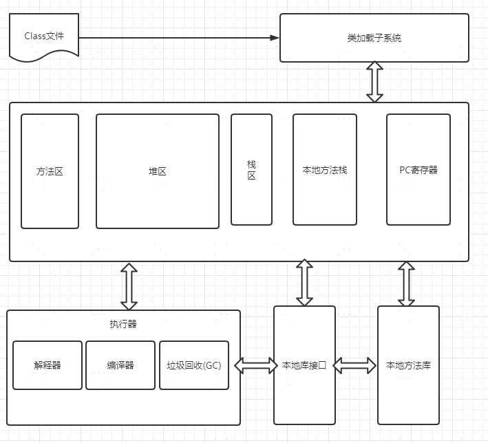
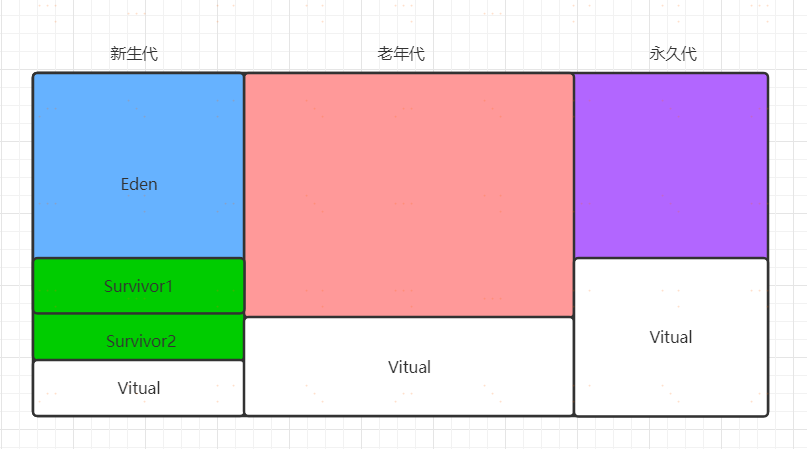
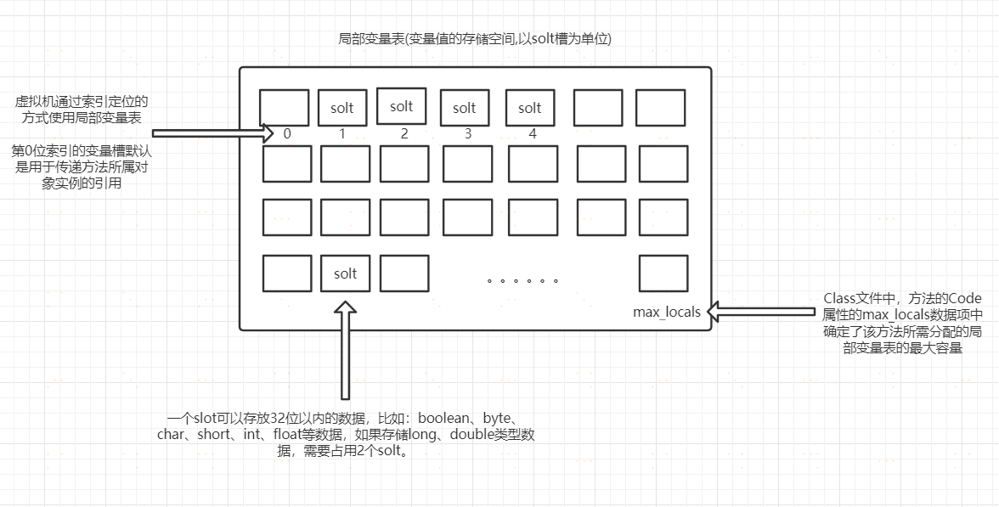
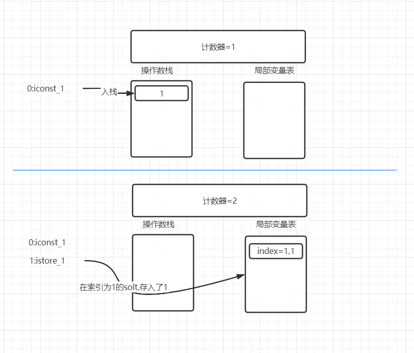

# 深入理解JVM（一）

>  JVM是Java Virtual Machine的缩写，通俗来说也就是运行java代码的容器。当项目启动时，会根据jvm相关配置参数，在计算机的内存中开启一片空间用于运行JVM

## 为什么要了解JVM？

​		对于Java程序员来说，在虚拟机自动内存管理机制的帮助下，不再需要为每一个new操作去写配对的delete/free代码，不容易出现内存泄漏和内存溢出问题，看起来由虚拟机管理内存一切都很美好。不过，也正是因为Java程序员把控制内存的权力交给了Java虚拟机，一旦出现内存泄漏和溢出方面的问题，如果不了解虚拟机是怎样使用内存的，那排查错误、修正问题将会成为一项异常艰难的工作。

## JVM的整体架构

>  JVM虚拟机主要有三部分组成，分别是类**加载子系统**、**运行时数据区**、**执行引擎**。

### 一、类加载子系统：

> Java虚拟机把描述类的数据从Class文件加载到内存，并对数据进行校验、转换解析和初始化，最终形成可以被虚拟机直接使用的Java类型。

### 二、运行时数据区

> Java虚拟机在执行Java程序的过程中会把它所管理的内存划分为若干个不同的数据区域。这些区域有各自的用途，以及创建和销毁的时间，有的区域随着虚拟机进程的启动而一直存在，有些区域则是依赖用户线程的启动和结束而建立和销毁。

运行时数据区是jvm中最为重要的部门。也是我们在调优时需要重点关注的区域，根据《Java虚拟机规范》中的规定，在运行时数据区将内存分为

* 方法区（Method Area）
* Java堆区（JavaHeap）
* Java虚拟机栈（Java Virtual Machine Stack）
* 程序计数器（Program Counter Register）
* 本地方法栈（Native Method Stacks）

####1. 方法区（Method Area）

> 与Java堆一样，是各个线程共享的内存区域，它用于存储已被虚拟机加载的类信息、常量、静态变量、即时编译器编译后的代码缓存等数据。

​		《Java虚拟机规范》中把方法区描述为堆的一个逻辑部分，它却有一个别名叫作“非堆”（Non-Heap），目的是与Java堆区分开来。JDK8之前将HotSpot虚拟机把收集器的分代设计扩展至方法区，所以可以将永久代看做是方法区，JDK8之后废弃永久代，用元空间来代替。

####2. java堆区（JavaHeap）

> Java堆是被所有线程共享的一块内存区域，在虚拟机启动时创建。此内存区域的唯一目的就是存放对象实例，Java世界里“几乎”所有的对象实例都在这里分配内存。

需要注意的是，《Java虚拟机规范》并没有对堆进行细致的划分，所以对于堆的讲解要基于具体的虚拟机，我们以使用最多的HotSpot虚拟机为例进行讲解。

Java堆是垃圾收集器管理的内存区域，因此它也被称作“GC堆”，这就是我们做JVM调优的重点区域部分。

#####2.1 在Jdk1.7中堆内存的划分

- Young 年轻区（代）
- Young区被划分为三部分，Eden区和两个大小严格相同的Survivor区，其中，Survivor区间中，某一时刻只有其中一个是被使用的，另外一个留做垃圾收集时复制对象用，在Eden区间变满的时候，GC就会将存活的对象移到空闲的Survivor区间中，根据JVM的策略，在经过几次垃圾收集后，任然存活于Survivor的对象将被移动到Tenured区间。
- Tenured 年老区
- Tenured区主要保存生命周期长的对象，一般是一些老的对象，当一些对象在Young复制转移一定的次数以后，对象就会被转移到Tenured区，一般如果系统中用了application级别的缓存，缓存中的对象往往会被转移到这一区间。
- Perm 永久区
- Perm代主要保存class,method,filed对象，这部份的空间一般不会溢出，除非一次性加载了很多的类，不过在涉及到热部署的应用服务器的时候，有时候会遇到java.lang. OutOfMemoryError : PermGen space 的误，造成这个错误的很大原因就有可能是每次都重新部署，但是重新部署后，类的class没有被卸载掉，这样就造成了大量的class对象保存在了perm中，这种情况下，一般重新启动应用服务器可以解决问题。
- Virtual区：最大内存和初始内存的差值，就是Virtual区。

#####2.2 在JDK1.8中堆内存的划分

由上图可以看出，jdk1.8的内存模型是由2部分组成，年轻代+ 年老代。

* 年轻代：Eden + 2*Survivor

* 年老代：OldGen

* 在jdk1.8中变化最大的Perm区，用Metaspace（元数据空间）进行了替换。

* 需要特别说明的是：Metaspace所占用的内存空间不是在虚拟机内部，而是在本地内存空间中，这也是与1.7的永久代最大的区别所在。

#####2.3 为什么废弃1.7中的永久区

> 官方给出的解释是:移除永久代是为融合HotSpot JVM与 JRockit VM而做出的努力，因为JRockit没有永久代，不需要配置永久代

#####2.4 空间分配

> 如果没有指定堆内存大小，默认初始堆内存为物理内存的1/64，最大不超过物理内存的1/4或1G。注意的是元空间会自动扩容，默认情况下不收限制。

#####2.4 对象的访问

- ava程序会通过栈上的reference数据来操作堆上的具体对象。
- 主流的访问方式主要有使用句柄和直接指针两种：
- 句柄访问
  Java堆中将可能会划分出一块内存来作为句柄池，reference中存储的就是对象的句柄地址，而句柄中包含了对象实例数据与类型数据各自具体的地址信息.使用直接指针访问Java堆中对象的内存布局就必须考虑如何放置访问类型数据的相关信息，reference中存储的直接就是对象地址，如果只是访问对象本身的话，就不需要多一次间接访问的开销
- 指针访问
  使用句柄来访问的最大好处就是reference中存储的是稳定句柄地址，在对象被移动（垃圾收集时移动对象是非常普遍的行为）时只会改变句柄中的实例数据指针，而reference本身不需要被修改。使用直接指针来访问最大的好处就是速度更快，它节省了一次指针定位的时间开销。HotSpot虚拟机采用的是指针访问方式实现。

#### 3. Java虚拟机栈（Java Virtual Machine Stack）

> 与程序计数器一样，Java虚拟机栈也是线程私有的，它的生命周期与线程相同。

Java虚拟机栈描述的是Java方法执行的线程内存模型，每个方法被执行的时候，Java虚拟机都会同步创建一个栈帧，用于存储局部变量表、操作数栈、动态连接、方法出口等信息。每一个方法被调用直至执行完毕的过程，就对应着一个栈帧在虚拟机栈中从入栈到出栈的过程。

#####3.1 局部变量表

- 局部变量表是一组变量值的存储空间，用于存放方法参数和方法内部定义的局部变量。
- 在Class文件中，方法的Code属性的max_locals数据项中确定了该方法所需分配的局部变量表的最大容量。
- 该表以变量槽（Variable Slot）为最小单位，一个slot可以存放32位以内的数据，比如：boolean、byte、
- char、short、int、float等数据，如果存储long、double类型数据，需要占用2个solt。
- 虚拟机通过索引定位的方式使用局部变量表，索引值的范围是从0开始至局部变量表最大的变量槽数量。
- 如果访问的是32位数据类型的变量，索引N就代表了使用第N个变量槽，如果访问的是64位数据类型的变量，则说明会同时使用第N和N+1两个变量槽。
- 局部变量表中第0位索引的变量槽默认是用于传递方法所属对象实例的引用，在方法中可以通过关键字“this”来访问到这个隐含的参数。其余参数则按照参数表顺序排列，占用从1开始的局部变量槽，参数表分配完毕后，再根据方法体内部定义的变量顺序和作用域分配其余的变量槽。

#####3.2 操作数栈：

- 操作数栈也常被称为操作栈，它是一个先进后出栈。
- 操作数栈的最大深度也在编译的时候被写入到Code属性的max_stacks数据项之中。
- 操作数栈的每一个元素都可以是包括long和double在内的任意Java数据类型。32位数据类型所占的栈容量为1，64位数据类型所占的栈容量为2。
- 方法刚刚开始执行的时候，这个方法的操作数栈是空的，在方法的执行过程中，会有各种字节码指令往操作数栈中写入和提取内容，也就是出栈和入栈操作。
- 操作数栈中元素的数据类型必须与字节码指令的序列严格匹配，例如iadd指令，不能出现一个long和一个float使用iadd命令相加的情况。

#####3.3 动态连接

- 每个栈帧都包含一个指向运行时常量池中该栈帧所属方法的引用，持有这个引用是为了支持方法调用过程中的动态连接。
- Class文件的常量池中存有大量的符号引用，字节码中的方法调用指令就以常量池里指向方法的符号引用作为参数。这些符号引用一部分会在类加载阶段或者第一次使用的时候就被转化为直接引用，这种转化被称为静态解析。另外一部分将在每一次运行期间都转化为直接引用，这部分就称为动态连接。

#####3.4 方法出口

- 当一个方法开始执行后，只有两种方式退出这个方法。
- 第一种方式是执行引擎遇到任意一个方法返回的字节码指令，这时候可能会有返回值传递给上层的方法调用者，方法是否有返回值以及返回值的类型将根据遇到何种方法返回指令来决定，这种退出方法的方式称为“正常调用完成”。
- 另外一种退出方式是在方法执行的过程中遇到了异常，并且这个异常没有在方法体内得到妥善处理。无论是Java虚拟机内部产生的异常，还是代码中使用throw字节码指令产生的异常，只要在本方法的异常表中没有搜索到匹配的异常处理器，就会导致方法退出，这种退出方法的方式称为“异常调用完成”。这种方法的返回是不会给它的上层调用者提供任何返回值的。
- 无论采用何种退出方式，在方法退出之后，都必须返回到最初方法被调用时的位置，程序才能继续执行，方法返回时可能需要在栈帧中保存一些信息，用来帮助恢复它的上层主调方法的执行状态。
- 方法退出的过程实际上等同于把当前栈帧出栈，因此退出时可能执行的操作有：恢复上层方法的局部变量表和操作数栈，把返回值（如果有的话）压入调用者栈帧的操作数栈中，调整PC计数器的值以指向方法调用指令后面的一条指令等。

以 int i = 1; 为例，看看虚拟机栈的执行

####4. 程序计数器（Program Counter Register）

> 是一块较小的内存空间，它可以看作是当前线程所执行的字节码的行号指示器。字节码解释器工作时就是通过改变这个计数器的值来选取下一条需要执行的字节码指令，它是程序控制流的指示器，分支、循环、跳转、异常处理、线程恢复等基础功能都需要依赖这个计数器来完成。

​		由于Java虚拟机的多线程是通过线程轮流切换、分配处理器执行时间的方式来实现的，在任何一个确定的时刻，一个处理器（对于多核处理器来说是一个内核）都只会执行一条线程中的指令。因此，为了线程切换后能恢复到正确的执行位置，每条线程都需要有一个独立的程序计数器，各条线程之间计数器互不影响，独立存储，我们称这类内存区域为“线程私有”的内存。

####5. 本地方法栈（Native Method Stacks）

> 本地方法栈（Native Method Stacks）与虚拟机栈所发挥的作用是非常相似的，其区别只是虚拟机栈为虚拟机执行Java方法（也就是字节码）服务，而本地方法栈则是为虚拟机使用到的本地（Native）方法服务。

###三、执行引擎

> 执行引擎用于执行JVM字节码指令，主要有两种方式，分别是解释执行和编译执行，区别在于，解释执行是在执行时翻译成虚拟机指令执行，而编译执行是在执行之前先进行编译再执行。解释执行启动快，执行效率低。编译执行，启动慢，执行效率高。垃圾回收器就是自动管理运行数据区的内存，将无用的内存占用进行清除，释放内存资源。

### 四、本地方法库和本地接口库

> 在jdk的底层中，有一些实现是需要调用本地方法完成的（使用c或c++写的方法），就是通过本地库接口调用完成的。比如：System.currentTimeMillis()方法

