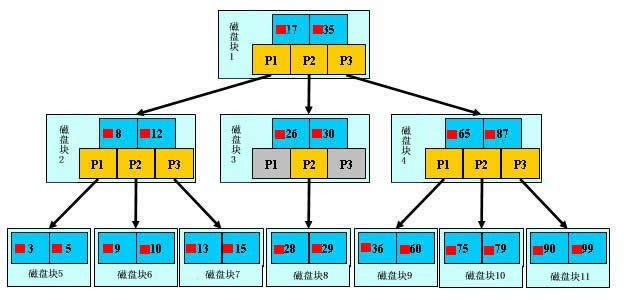

#### 索引失效

1.有or必全有索引;
2.复合索引未用左列字段;
3.like以%开头;
4.需要类型转换;
5.where中索引列有运算;
6.where中索引列使用了函数;

7.如果mysql觉得全表扫描更快时（数据少）;

#### 什么时候没有必要使用索引？

1.唯一性差;
2.频繁更新的字段不用（更新索引消耗）;
3.where中不用的字段;
4.索引使用<>时，效果一般;

#### Explain的Type

  system：**表只有一行记录，相当于系统表**

  const：**通过索引一次就找到，只匹配一行数据**

  eq_ref: **唯一性索引扫描，对于每个索引键，表中只有一条记录与之匹配**

  ref：**非唯一性索引扫描，返回匹配某个单独值的所有行**：用于=、<、> 操作符带索引的列

  range：**只检索给定范围的行，使用一个索引来选择行** ：一般使用 between、<、>

  index：**只遍历索引树**

  ALL：**全表扫描，性能最差**  

<<<<<<< HEAD
#### 排查慢查询SQL

开启慢查询：set global slow_query_log=on; 

设置慢查询阈值：set long_query_time=0.3;

##### 优化：

explain--type

组合索引：组合索引最多可以包括16个字段。并且只有查询条件使用了这些字段中的第一个字段时，索引才会被使用。

表结构设计：冗余字段，通过表的数据目的分解表，增加中间表

#### 唯一索引会死锁吗？

对于唯一索引，insert成功后，会加上==排它锁==X lock；

对于唯一索引的插入，需要在插入前进行duplicate key的检查，所以需要申请加上==共享锁== S lock，由于S lock与X lock不兼容，所以产生锁等待；

 由于间隙锁GAP与插入意向锁INSERT_INTENTION不兼容，所以产生锁等待，至此死锁产生。

##### 解决：

由于事发的逻辑为：一个事务中进行多次insert，也就是说数据库多次申请锁资源，并且是并发的事务，所以当插入的数据出现资源抢占时，容易发生死锁。

所以建议：==insert时插入多个值，一次性申请该sql的所有锁资源==。这样，则可以避免多次申请锁资源，同时在性能上也能得以提升。

==查询加的是共享锁，更新就是排它锁==

#### mysql的连接数？
=======

##### mysql的连接数？
>>>>>>> 4df259e0e3151344679740ab317073b7b8754dc3

mysql的最大连接数默认是100, 最大可以达到16384

1. set GLOBAL max_connections=1000。设置全局最大连接数（重启会恢复默认）
2. 通过修改mysql安装目录下my.ini配置文件的max_connections

<<<<<<< HEAD

#### MySQL事务隔离级别

| 事务隔离级别                      | 脏读 | 不可重复读 | 幻读 |
| --------------------------------- | ---- | ---------- | ---- |
| 读未提交（read-uncommitted）      | 是   | 是         | 是   |
| 不可重复读（read-committed）      | 否   | 是         | 是   |
| ==可重复读RR（repeatable-read）== | 否   | 否         | 是   |
| 串行化（serializable）            |      |            |      |

MySQL==默认的隔离级别是可重复读==，即：事务A在读到一条数据之后，此时事务B对该数据进行了修改并提交，那么事务A再读该数据，读到的还==是原来的内容==。 

使用的的一种叫MVCC的控制方式 ，即Mutil-Version Concurrency Control,==多版本并发控制，类似于乐观锁的一种实现方式==

InnoDB在==每行记录后面保存两个隐藏的列==，分别保存了这个==行的创建时间==和==行的删除时间==。这里存储的并不是实际的时间值,而是系统版本号，当数据被修改时，版本号加1
在读取事务开始时，系统会给当前读事务一个版本号，事务会==读取版本号<=当前版本号==的数据

=======
### **MySQL事务隔离级别**

| 事务隔离级别                 | 脏读 | 不可重复读 | 幻读 |
| ---------------------------- | ---- | ---------- | ---- |
| 读未提交（read-uncommitted） | 是   | 是         | 是   |
| 不可重复读（read-committed） | 否   | 是         | 是   |
| 可重复读（repeatable-read）  | 否   | 否         | 是   |
| 串行化（serializable）       |      |            |      |
>>>>>>> 4df259e0e3151344679740ab317073b7b8754dc3

#### 事务的四大特性

原子性 一致性 隔离性 持久性

#### 回表？

<<<<<<< HEAD
回表就是先通过数据库索引扫描出数据所在的行，再通过行主键id取出索引中未提供的数据，即基于非主键索引的查询需要多扫描一棵索引树。因此，可以通过索引先查询出id字段，再通过主键id字段，查询行中的字段数据，即通过再次查询提供MySQL查询速度.

=======
回表就是先通过数据库索引扫描出数据所在的行，再通过行主键id取出索引中未提供的数据，即基于非主键索引的查询需要多扫描一棵索引树。因此，可以通过索引先查询出id字段，再通过主键id字段，查询行中的字段数据，即通过再次查询提供MySQL查询速度.
>>>>>>> 4df259e0e3151344679740ab317073b7b8754dc3
