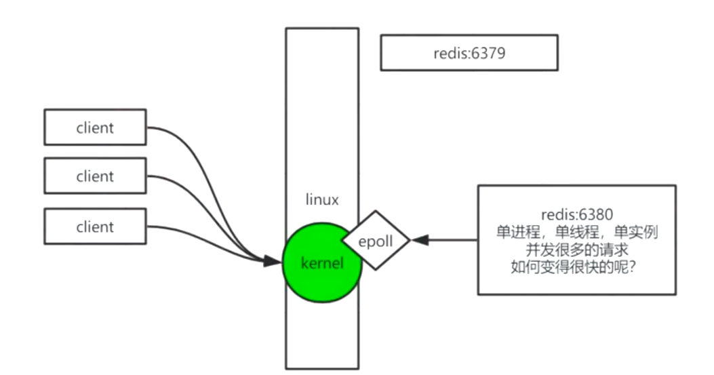
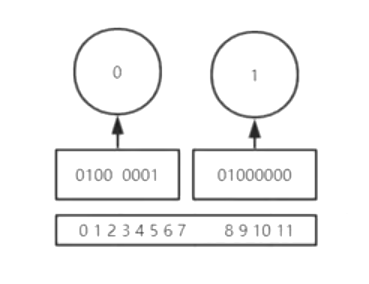
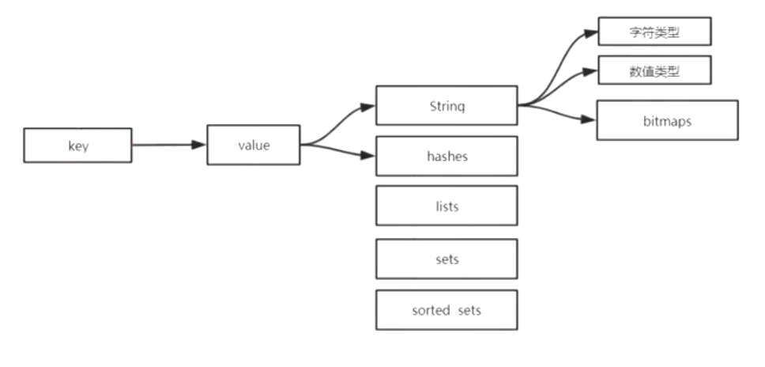

# Redis

> REmote DIctionary Server(Redis) 是一个由 Salvatore Sanfilippo 写的 key-value 存储系统，是跨平台的非关系型数据库。
>
> Redis 是一个开源的使用 ANSI C 语言编写、遵守 BSD 协议、支持网络、可基于内存、分布式、可选持久性的键值对(Key-Value)存储数据库，并提供多种语言的 API。
>
> Redis 通常被称为数据结构服务器，因为值（value）可以是字符串(String)、哈希(Hash)、列表(list)、集合(sets)和有序集合(sorted sets)等类型。


## 特点：

* redis默认为16个库

* 任何list、set、和sorted set都可以放232个元素。


## 为什要用redis

#### redis和mysql的IO区别

##### mysql

B+Tree在内存中只保存了树干，通过树干找到索引区间（datapage）放入内存，在内存中用二分查找锁定指针，按照同样步骤直至找到做后一个datapage。因为mysql属于行级存储，所以会通过索引去找到的是一整行数据data page。

这里的datapage是磁盘页

**行级存储（Row-based ）：**在创建表时，必须给出**schema**字节宽度(包括列的数据类型，列数量等等）

###### 在磁盘中，一次完整的IO操作为

​		旋转延迟（磁盘轴旋转时间）+寻道时间（磁盘臂移动时间）+带宽（数据传输时间）

磁盘：1. 寻址（毫秒ms），2. 带宽（M）


##### Redis 

当拿到一个key后， redis 先判断当前库的[0]号哈希表是否为空，为空直接返回NULL；判断该0号哈希表是否在rehash，如果正在进行rehash，将调用一次_dictRehashStep方法进行被动 rehash，然后根据计算出的索引值在哈希表中取出链表，遍历该链表找到key的位置，一般情况，该链表长度为1；当 ht[0] 查找完了之后，再进行了次rehash判断，如果未在rehashing，则直接结束，否则对ht[1]重复上述步骤。

内存：1. 寻址（纳秒ns）， 2. 带宽（G）

> 总结：当并发大时，数据库因磁盘寻址与行级存储数据冗余从而占用IO的影响，性能会受很大的影响。


## Redis与内核交互原理

#### Redis单线程如何变得很快的

若干客户端连接（client）先到达内核，Redis通过调用系统内核（kernel）提供的**epoll**（非阻塞多路复用IO）来处理客户端操作请求。




## 数据类型

### 相关概念

* 正反向索引

* 二进制安全

  redis通过内核只取字节流

  * redis-cli  —raw：显示中文

### 基础数据数据

- String：string 类型的值最大能存储 512MB。
- List 列表：**双向链表**，按照插入顺序排序，添加元素到列表的头部（左边）或者尾部（右边）。 232 -1 键值对（40多亿）
- Hash 散列：**数组+链表**，hash 特别适合用于存储对象。每个 hash 可以存储 232 -1 键值对（40多亿）。使用：**HMSET**，**HGet** 
- Set 集合：**哈希表**，元素不可重复，集合是通过哈希表实现的，所以添加，删除，查找的复杂度都是 O(1)。232 -1 键值对（40多亿）
- ZSet（Sorted Set） 有序集合：**跳跃表**，每个元素都会关联一个double类型的分数。redis正是通过分数来为集合中的成员进行从小到大的排序。


### String

#### 基础命令

```shell
get key
set key value [过期时间（毫秒或者秒）][NX|XX]
//NX:不存在则设置//XX:存在则设置

mset 同时设置一个或多个 key-value 对。
mget key，key
getset key value//将给定 key 的值设为 value ，并返回 key 的旧值(old value)。

getrange key start end 返回 key 中字符串值的子字符

GETBIT key offset//对 key 所储存的字符串值，获取指定偏移量上的位(bit)。
```


#### bitmap

> 8bit = 1b = 0.001kb
>
> strlen key 计算其所占字节
>
> 空间占用、以及第一次分配空间需要的时间
> offset 为 2^32-1(分配 512MB)需要～ 300ms
> offset 为 2^30-1(分配 128MB)需要～ 80ms
> offset 为 2^28-1(分配 32MB)需要～ 30ms
> offset 为 2^26-1(分配 8MB)需要 8ms。
>
> 大概的空间占用计算公式是：($offset/8/1024/1024)MB



##### setbit：

```shell
setbit key offset value
setbit k1 1 1
设置key[k1]在offset=1（二进制位上从左到右从0开始第2个二进制）为value 1
```

##### bitpos：

```shell
bitpos key bit start end
bitpos k1 1 1 1
获取key[k1]在字节1-1之间（也就是1上）二进制值上第一个bit值为1的位置（下标）。
结果：9
```

##### bitcount：

```shell
bitcount key start end
bitcount k1 0 1
获取key[k1]在字节0-1之间（也就是0和1上）所有bit值为1的数量。
```

##### bitop：

```shell
//setbit k1 1 1
//setbit k1 7 1
//setbit k2 1 1
//setbit k2 6 1
//此时k1 的二进制：0100 0001
//此时k2 的二进制：0100 0010

bitop key offset value
bitop and andkey k1 k2
将k1 and k2的and运算存到andkey里
andkey结果：“@”
//此时andkey的二进制：0100 0000
```


##### 用来处理如用户登录日志类数据

```shell
setbit KEY_NAME OFFSET VALUE //该命令用于对 key 所储存的字符串值，设置或清除指定偏移量上的位(bit)。时间复杂度O（1）
bitop or destkey 20190101 20190102
Bit count destroy 0 -1
结果：2
```

```
setbig sean 1 1
setbig sean 7 1
setbit sean 364 1
STRLEN sean
BitCount sean -2 -1
```


### List

#### 语法：

```shell
lpush k1  a b c d e f							向list中链表左边一个个插入

rpush key val..								 	右边一个个插入

lindex key 索引								   根据索引获取值

lset key 索引 值								  修改某个索引的值

lrange key start end							获取索引段的值

lrem key count value							从左边删除几个为value的记录

linsert key after 插入值 某个值			        在第一个前面插入

linsert key before 插入值 某个值	                在第一个后插入

blpop key value			  					    阻塞的单播订阅，先进先出

lrange key start end						    删除start end两端的值
```


#### 特点

* List是一个**双向链表**的结构

* list中的key有两个属性：head头、tall尾

* List变成一个栈：同向命令（lpush lpool）和（rpush rpoot）先进后出
* List变成一个队列：反向命令（lpush rpool）和（rpush lpoot）先进先出
* List也可以看成一个数组。


### Hash

#### 语法

```shell
hset

hmset

hget

hmget

hkeys

hvals

hgetall
```

#### 特点

应用于对象存储，用户计算的key-val值，项目应用如：点赞，收藏，详情


### Set无序集合

#### 语法

```shell
sadd

sinter key1 key2 获取交集

sinterstore dest key1 key2 获取交集并放到dest中

sunion k1 k2 并集 也指出store。如：sunionstore

sdiff  key1 key2 差集 根据key的先后顺序获取不同结果
```

#### 特点：

##### 随机事件

```shell
srandmember key count：

Count正数：取出一个去重的结果集，不能超过已有集

count负数：取出一个带重复的结果集，一定满足你的数量

如果为0，不返回
```

```shell
spop k1

从集合中随机取出一个，并删除。
```

主要用于计算交差集、抽奖


### sorted Set有序集合（zset）

#### 特点：

* 必须给score

* 物理内存左小右大，不会随命令发生变化

* 可以取分值、排名

* 分值可以进行计算

* 可以进行集合操作：默认交集，相加score；会计算**权重**（相乘），还可以对集合进行**聚合函数**sum、max、min

* 是通过一个**跳跃表SkipList**实现


### 其他命令：

```shell
DEL key
该命令用于在 key 存在时删除 key。

DUMP key
序列化给定 key ，并返回被序列化的值。

EXISTS key
检查给定 key 是否存在。

EXPIRE key seconds
为给定 key 设置过期时间，以秒计。

EXPIREAT key timestamp
EXPIREAT 的作用和 EXPIRE 类似，都用于为 key 设置过期时间。 不同在于 EXPIREAT 命令接受的时间参数是 UNIX 时间戳(unix timestamp)。

PEXPIRE key milliseconds
设置 key 的过期时间以毫秒计。

PEXPIREAT key milliseconds-timestamp
设置 key 过期时间的时间戳(unix timestamp) 以毫秒计

KEYS pattern
查找所有符合给定模式( pattern)的 key 。

MOVE key db
将当前数据库的 key 移动到给定的数据库 db 当中。

PERSIST key
移除 key 的过期时间，key 将持久保持。

PTTL key
以毫秒为单位返回 key 的剩余的过期时间。

TTL key
以秒为单位，返回给定 key 的剩余生存时间(TTL, time to live)。

RANDOMKEY
从当前数据库中随机返回一个 key 。

RENAME key newkey
修改 key 的名称

RENAMENX key newkey
仅当 newkey 不存在时，将 key 改名为 newkey 。

SCAN cursor [MATCH pattern] [COUNT count]
迭代数据库中的数据库键。

TYPE key
返回 key 所储存的值的类型。
```




## Reds的雪崩、穿透、击穿

#### 缓存雪崩和解决方案

> 指同一时间节点，大量并发获取的**redis**的**key**大量过期或者宕机了，导致数据库压力

* 保持缓存层的高可用性

* 限流降级组件

* 随机过期时间：优化过期时间，过期时间加随机数，减少集体过期的可能性

* 使用互斥锁**(mutex key)**重建缓存

* 异步重建缓存


#### 缓存穿透解决方案

> redis查不到，透过缓存服务器去db，穿透——当redis不存在

在某些时间点被超高并发地访问

* 参数校验
* 缓存无效key
* 布隆过滤器
  * 在客户端处理，加入布隆过滤器算法
  * redis集成布隆
  * 缺点：只能增加，不能删除。


#### 缓存击穿解决方案

> 单个缓存key请求量太大，缓存过期

* 使用互斥锁(mutex key)  

  业界比较常用的做法，是使用mutex。简单地来说，就是在缓存失效的时候（判断拿出来的值为空），不是立即去load db，而是先使用缓存工具的某些带成功操作返回值的操作（比如Redis的SETNX或者Memcache的ADD）去set一个mutex key，当操作返回成功时，再进行load db的操作并回设缓存；否则，就重试整个get缓存的方法。

* 分布式锁Setnx，是「SET if Not eXists」的缩写，也就是只有不存在的时候才设置，可以利用它来实现锁的效果。


## 管道

## Redis 管道（Pipelining）

> 一次请求/响应服务器能实现处理新的请求即使旧的请求还未被响应。这样就可以将*多个命令*发送到服务器，而不用等待回复，最后在一个步骤中读取该答复。
>
> 这就是管道（pipelining），是一种几十年来广泛使用的技术。例如许多POP3协议已经实现支持这个功能，大大加快了从服务器下载新邮件的过程。

Redis很早就支持管道（pipelining）技术，因此无论你运行的是什么版本，你都可以使用管道（pipelining）操作Redis。下面是一个使用的例子：

```shell
$ (printf "PING\r\nPING\r\nPING\r\n"; sleep 1) | nc localhost 6379
+PONG
+PONG
+PONG
```

**重要说明**: 使用管道发送命令时，服务器将被迫回复一个队列答复，占用很多内存。所以，如果你需要发送大量的命令，最好是把他们按照合理数量分批次的处理，例如10K的命令，读回复，然后再发送另一个10k的命令，等等。这样速度几乎是相同的，但是在回复这10k命令队列需要非常大量的内存用来组织返回数据内容。


## 内存优化

### 方式

* 小的聚合类型数据的特殊编码处理

* 使用32位的redis

* 位级别和字级别的操作

* 尽可能使用散列表（hashes）

  小散列表（是说散列表里面存储的数少）使用的内存非常小，所以你应该尽可能的将你的数据模型抽象到一个散列表里面。比如你的web系统中有一个用户对象，不要为这个用户的名称，姓氏，邮箱，密码设置单独的key,而是应该把这个用户的所有信息存储到一张散列表里面

* 使用散列结构高效存储抽象的键值对

* 内存分配

  为了存储用户数据,当设置了maxmemory后Redis会分配几乎和maxmemory一样大的内存（然而也有可能还会有其他方面的一些内存分配）


### Redis内存淘汰机制

> 在redis.config中需要搜索 maxmemory-policy 来设置淘汰策略

Redis提供了下面几种淘汰策略供用户选择，其中默认的策略为noeviction策略 

* noeviction：当内存使用达到阈值的时候，所有引起申请内存的命令会报错。
* allkeys-lru：在主键空间中，优先移除最近未使用的key。
* volatile-lru：在设置了过期时间的键空间中，优先移除最近未使用的key。
* allkeys-random：在主键空间中，随机移除某个key。
* volatile-random：在设置了过期时间的键空间中，随机移除某个key。
* volatile-ttl：在设置了过期时间的键空间中，具有更早过期时间的key优先移除。


## 分区

> 分区是将你的数据分发到不同redis实例上的一个过程，每个redis实例只是你所有key的一个子集

#### 为什么分区非常有用

Redis分区主要有两个目的:

- 分区可以让Redis管理更大的内存，Redis将可以使用所有机器的内存。如果没有分区，你最多只能使用一台机器的内存。
- 分区使Redis的计算能力通过简单地增加计算机得到成倍提升,Redis的网络带宽也会随着计算机和网卡的增加而成倍增长。


#### 不同的分区实现方案

* 客户端分区
* 代理分区
* 查询路由(Query routing)


## 分布式锁

* setnx
* 过期时间
* 多线程（守护时间），延长过期时间
* redission
* zookeeoer

更多的是在DB或在架构上做出调整


## API

redis在java中使用。

* 注入高度封装对象redisTemplate
* 使用jedis包


>  参考文献
>
> http://redis.cn/documentation.html
>
> [https://www.runoob.com/](https://www.runoob.com/redis/redis-keys.html)
>
> [聊聊Linux 五种IO模型](https://www.jianshu.com/p/486b0965c296)
>
> [Java新一代网络编程模型AIO原理及Linux系统AIO介绍](http://www.52im.net/thread-306-1-1.html)

