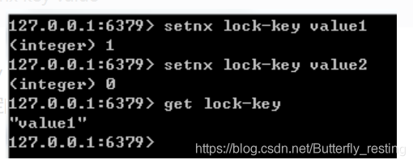

#### redis相比memcached有哪些优势？

memcached所有的值均是简单的字符串，redis作为其替代者，支持更为丰富的数据类型

redis的速度比memcached快很多 

redis可以持久化其数据

#### redis适用于的场景?

会话缓存（Session Cache），全页缓存（FPC）,队列，排行榜/计数器，发布/订阅

#### redis的过期策略？

redis采用的是**定期删除+惰性删除策略**。

#### redis内存淘汰机制？

* noeviction：当内存使用达到阈值的时候，所有引起申请内存的命令会报错。
* allkeys-lru：在主键空间中，优先移除最近未使用的key。
* volatile-lru：在设置了过期时间的键空间中，优先移除最近未使用的key。
* allkeys-random：在主键空间中，随机移除某个key。
* volatile-random：在设置了过期时间的键空间中，随机移除某个key。
* volatile-ttl：在设置了过期时间的键空间中，具有更早过期时间的key优先移除。

#### redis的并发问题如何解决?

客户端角度：对连接进行池化，同时对客户端读写Redis操作采用内部锁synchronized

服务器角度，利用setnx实现锁。

#### WATCH命令和基于CAS的乐观锁?

在Redis的事务中，WATCH命令可用于提供CAS(check-and-set)功能

#### 使用过Redis分布式锁么，它是什么回事？

先拿setnx来争抢锁，抢到之后，再用expire给锁加一个过期时间防止锁忘记了释放。

##### 		如果在setnx之后执行expire之前进程意外crash或者要重启维护了，那会怎么样？

​		使用管道，合并命令

#### 假如Redis里面有1亿个key，其中有10w个key是以某个固定的已知的前缀开头的，如果将它们全部找出来？

可以使用scan指令，scan指令可以无阻塞的提取出指定模式的key列表，但是会有一定的重复概率，在客户端做一次去重就可以了，但是整体所花费的时间会比直接用keys指令长。

#### 使用过Redis做异步队列么，你是怎么用的？

一般使用list结构作为队列，rpush生产消息，lpop消费消息。当lpop没有消息的时候，要适当sleep一会再重试。

如不使用sleep可以使用blpop指令，在没有消息的时候，它会阻塞住直到消息到来。

使用pub/sub主题订阅者模式，可以实现1:N的消息队列。

#### Redis持久化？

bgsave做镜像全量持久化，aof做增量持久化。因为bgsave会耗费较长时间，不够实时，在停机的时候会导致大量丢失数据，所以需要aof来配合使用。在redis实例重启时，会使用bgsave持久化文件重新构建内存，再使用aof重放近期的操作指令来实现完整恢复重启之前的状态。

#### Redis 常见性能问题和解决方案？

(1) Master 最好不要做任何持久化工作，如 RDB 内存快照和 AOF 日志文件

(2) 如果数据比较重要，某个 Slave 开启 AOF 备份数据，策略设置为每秒同步一次

(3) 为了主从复制的速度和连接的稳定性， Master 和 Slave 最好在同一个局域网内

(4) 尽量避免在压力很大的主库上增加从库

(5) 主从复制不要用图状结构，用单向链表结构更为稳定，即： Master <- Slave1 <- Slave2 <-Slave3…

#### 讲解下Redis线程模型

文件事件处理器包括分别是**套接字、 I/O 多路复用程序、 文件事件分派器（dispatcher）、 以及事件处理器**。

使用 I/O 多路复用程序来同时监听多个套接字， 并根据套接字目前执行的任务来为套接字关联不同的事件处理器。当被监听的套接字准备好执行连接应答（accept）、读取（read）、写入（write）、关闭（close）等操作时， 与操作相对应的文件事件就会产生， 这时文件事件处理器就会调用套接字之前关联好的事件处理器来处理这些事件。

I/O 多路复用程序负责监听多个套接字， 并向文件事件分派器传送那些产生了事件的套接字。

#### 为什么Redis的操作是原子性的，怎么保证原子性的？

对于Redis而言，命令的原子性指的是：一个操作的不可以再分，操作要么执行，要么不执行。

Redis的操作之所以是原子性的，是因为Redis是单线程的。

Redis本身提供的所有API都是原子操作，Redis中的事务其实是要保证批量操作的原子性。

##### 		多个命令在并发中也是原子性的吗？

​		不一定， 将get和set改成单命令操作，incr 。使用Redis的事务，或者使用Redis+Lua==的方式实现.

#### Redis实现分布式锁

Redis为单进程单线程模式，采用队列模式将并发访问变成串行访问，且多客户端对Redis的连接并不存在竞争关系Redis中可以使用SETNX命令实现分布式锁。

将 key 的值设为 value ，当且仅当 key 不存在。 若给定的 key 已经存在，则 SETNX 不做任何动作

解锁：使用 del key 命令就能释放锁

解决死锁：

1）通过Redis中expire()给锁设定最大持有时间，如果超过，则Redis来帮我们释放锁。

2） 使用 setnx key “当前系统时间+锁持有的时间”和getset key “当前系统时间+锁持有的时间”组合的命令就可以实现。

#### 主从复制模式下，主挂了怎么办？redis提供了哨兵模式（高可用）

何谓哨兵模式？就是通过哨兵节点进行自主监控主从节点以及其他哨兵节点，发现主节点故障时自主进行故障转移。

#### 哨兵模式实现原理？（2.8版本或更高才有）

1. ##### 三个定时监控任务

2. ##### 主客观下线

3. ##### 选举出某一哨兵节点作为领导者，来进行故障转移

4. ##### 故障转移（选举新主节点流程）

> 参考文献
>
> https://zhuanlan.zhihu.com/p/265995511
>
> https://blog.csdn.net/zlc3323/article/details/80836881